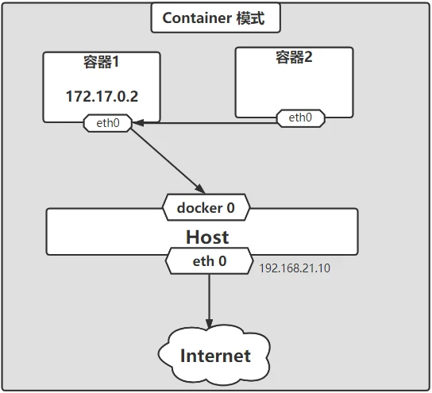

# Docker进阶（二）容器网络
---

---
## 1. 容器网络

思考问题：
1. docker是如何处理容器的网络访问的？

Docker使用Linux桥接（参考[Linux虚拟网络技术](https://blog.csdn.net/ysds20211402/article/details/122807048)》），在宿主机虚拟一个Docker容器网桥(docker0)，Docker启动一个容器时会根据Docker网桥的网段分配给容器一个IP地址，称为Container-IP，同时Docker网桥是每个容器的默认网关。因为在同一宿主机内的容器都接入同一个网桥，这样容器之间就能够通过容器的Container-IP直接通信。

Docker网桥是宿主机虚拟出来的，并不是真实存在的网络设备，外部网络是无法寻址到的，这也意味着外部网络无法通过直接Container-IP访问到容器。如果容器希望外部访问能够访问到，可以通过映射容器端口到宿主主机（端口映射），即docker run创建容器时候通过 -p 或 -P 参数来启用，访问容器的时候就通过 [宿主机IP]:[容器端口] 访问容器。

当你安装Docker时，它会自动创建三个网络。你可以使用以下 docker network ls 命令列出这些网络：
```
[root@localhost ~]# docker network ls
NETWORK ID     NAME                  DRIVER    SCOPE
96e5ce3a3d4b   bridge                bridge    local
8e2035cc3c6f   composetest_default   bridge    local
796dbf4574cd   docker_gwbridge       bridge    local
109b6ccc0674   host                  host      local
3c6d878c6b8f   mynet                 bridge    local
06d513d8bac7   none                  null      local
```

### 1.1 docker0
- docker0是docker安装时候自带的一个虚拟网卡，与物理网卡是属于nat关系。
- evth-pair技术，是一堆虚拟设备接口，他们是成对出现的，一段连着的协议，一段彼此相连的。正是因为有这个特性，evth-pair充当一个桥梁，连接各种虚拟网络设备

- --link，是使用的/etc/hosts做映射，因此容器互联需要相互配置，且IP变更了之后还是不能通过容器名称进行联通的，不建议使用。

### 1.2 docker network自定义网络
```
[root@localhost ~]# docker network ls
NETWORK ID     NAME      DRIVER    SCOPE
fb2729c7eadc   bridge    bridge    local
109b6ccc0674   host      host      local
06d513d8bac7   none      null      local
```
- bridge：桥接（默认）
- none：不配置网络
- host：主机模式，和linux主机共享网络
- container：容器内网络联通，是容器直接互联

可以查看docker network有什么功能：
```
[root@localhost ~]# docker network --help

Usage:  docker network COMMAND

Manage networks

Commands:
  connect     Connect a container to a network
  create      Create a network
  disconnect  Disconnect a container from a network
  inspect     Display detailed information on one or more networks
  ls          List networks
  prune       Remove all unused networks
  rm          Remove one or more networks

Run 'docker network COMMAND --help' for more information on a command.
```
可以通过network创建一个网络，先看一下啊create参数应用：
```
[root@localhost ~]# docker network create --help

Usage:  docker network create [OPTIONS] NETWORK

Create a network

Options:
      --attachable           Enable manual container attachment
      --aux-address map      Auxiliary IPv4 or IPv6 addresses used by Network driver (default map[])
      --config-from string   The network from which to copy the configuration
      --config-only          Create a configuration only network
  -d, --driver string        Driver to manage the Network (default "bridge")
      --gateway strings      IPv4 or IPv6 Gateway for the master subnet
      --ingress              Create swarm routing-mesh network
      --internal             Restrict external access to the network
      --ip-range strings     Allocate container ip from a sub-range
      --ipam-driver string   IP Address Management Driver (default "default")
      --ipam-opt map         Set IPAM driver specific options (default map[])
      --ipv6                 Enable IPv6 networking
      --label list           Set metadata on a network
  -o, --opt map              Set driver specific options (default map[])
      --scope string         Control the network's scope
      --subnet strings       Subnet in CIDR format that represents a network segment
```

应用：
```
docker network create --driver bridge --subnet 192.168.0.0/16 --gateway 192.168.0.1  mynet
```

这样能够创建一个网络，通过docker network ls可以查看配置的子网
```
[root@localhost ~]# docker network ls
NETWORK ID     NAME      DRIVER    SCOPE
fb2729c7eadc   bridge    bridge    local
109b6ccc0674   host      host      local
3c6d878c6b8f   mynet     bridge    local
06d513d8bac7   none      null      local
```
使用自定义网络，在创建容器分配地址的时候，就使用--net进行自定义网络即可
```
docker run -itd -v /data/pg_data/:/data -w /data -e POSTGRES_PASSWORD=password --net mynet --name pgserver -p 5432:5432 postgres:11
```

**而且自定义网络中自带了IP和域名的映射，可以通过容器名称访问容器**
即直接在别的docker中进行：
```
ping pgserver
```
可以成功ping

### 1.3 网络之间的联通
很容易可以联想到，创建的网络往往是有其功能作用的，比如docker部署redis和mysql的集群：
- redis: 划分网络172.24.18.0/24
- mysql: 划分网络172.24.17.0/24

一个网段内部肯定是可以互联互通的，但是让redis和mysql两个网段之间能互通，则需要进行配置网络间互通的配置。

联通一个容器到网络，可以从上面的network参数当中看到，connect的方式可以把容器连接到一个网络当中
```
[root@localhost ~]# docker network connect --help

Usage:  docker network connect [OPTIONS] NETWORK CONTAINER

Connect a container to a network

Options:
      --alias strings           Add network-scoped alias for the container
      --driver-opt strings      driver options for the network
      --ip string               IPv4 address (e.g., 172.30.100.104)
      --ip6 string              IPv6 address (e.g., 2001:db8::33)
      --link list               Add link to another container
      --link-local-ip strings   Add a link-local address for the container
```
我们按照上面操作先创建一个新的网络mynet02
```
docker network create --driver bridge --subnet 192.167.0.0/16 --gateway 192.167.0.1  mynet02
```
让上面的创建的容器pgserver能够连接到mynet当中
```
docker network connect mynet02 pgserver
```
然后查看网络mynet02即可看到pgserver容器已经在mynet02当中了

```
docker network inspect mynet02
```
注意：connect只能够实现某一个容器访问网络，如果想要多个容器能够访问这个网络，那么原则上属于网络规划问题。


## 2. docker network的类型

docker主要有四种网络模式，以及介绍几个docker常见的网络

### 2.1 bridge

当Docker进程启动时，会在主机上创建一个名为docker0的虚拟网桥，此主机上启动的Docker容器会连接到这个虚拟网桥上。虚拟网桥的工作方式和物理交换机类似，这样主机上的所有容器就通过交换机连在了一个二层网络中。

从docker0子网中分配一个IP给容器使用，并设置docker0的IP地址为容器的默认网关。在主机上创建一对虚拟网卡veth pair设备，Docker将veth pair设备的一端放在新创建的容器中，并命名为eth0（容器的网卡），另一端放在主机中，以vethxxx这样类似的名字命名，并将这个网络设备加入到docker0网桥中。可以通过brctl show命令查看。

bridge模式是docker的默认网络模式，不写–net参数，就是bridge模式。使用docker run -p时，docker实际是在iptables做了DNAT规则，实现端口转发功能。可以使用==iptables -t nat -vnL #00BCD4==查看。

bridge模式如下图所示：


###  2.2 host模式

如果启动容器的时候使用host模式，那么这个容器将不会获得一个独立的Network Namespace，而是和宿主机共用一个Network Namespace。容器将不会虚拟出自己的网卡，配置自己的IP等，而是使用宿主机的IP和端口。但是，容器的其他方面，如文件系统、进程列表等还是和宿主机隔离的。

使用host模式的容器可以直接使用宿主机的IP地址与外界通信，容器内部的服务端口也可以使用宿主机的端口，不需要进行NAT，host最大的优势就是网络性能比较好，但是docker host上已经使用的端口就不能再用了，网络的隔离性不好。

Host模式如下图所示：


### 2.3 container模式

这个模式指定新创建的容器和已经存在的一个容器共享一个 Network Namespace，而不是和宿主机共享。新创建的容器不会创建自己的网卡，配置自己的 IP，而是和一个指定的容器共享 IP、端口范围等。同样，两个容器除了网络方面，其他的如文件系统、进程列表等还是隔离的。两个容器的进程可以通过 lo 网卡设备通信。

Container模式示意图：




### 2.4 none模式

使用none模式，Docker容器拥有自己的Network Namespace，但是，并不为Docker容器进行任何网络配置。也就是说，这个Docker容器没有网卡、IP、路由等信息。需要我们自己为Docker容器添加网卡、配置IP等。

这种网络模式下容器只有lo回环网络，没有其他网卡。none模式可以在容器创建时通过–network=none来指定。这种类型的网络没有办法联网，封闭的网络能很好的保证容器的安全性。

### 2.5 overlay模式
参考自：
1. [http://www.dockone.io/article/2717](http://www.dockone.io/article/2717)
2. [https://blog.csdn.net/dhaiuda/article/details/82824333](https://blog.csdn.net/dhaiuda/article/details/82824333)
3. [https://blog.csdn.net/weixin_48447848/article/details/122678226](https://blog.csdn.net/weixin_48447848/article/details/122678226)

##### (1) 什么是overlay网络
overlay网络用于连接不同机器上的docker容器，允许不同机器上的容器相互通信，同时支持对消息进行加密，当我们初始化一个swarm或是加入到一个swarm中时，在docker主机上会出现两种网络：

1. 称为ingress的overlay网络，用于传递集群服务的控制或是数据消息，若在创建swarm服务时没有指定连接用户自定义的overlay网络，将会加入到默认的ingress网络
2. 名为docker_gwbridge桥接网络会连接swarm中所有独立的docker系统进程

可以使用docker network create创建自定义的overlay网络，容器以及服务可以加入多个网络，只有同一网络中的容器可以相互交换信息，可以将单一容器或是swarm服务连接到overlay网络中，但是两者在overlay网络中的行为会有所不同，接下来会描述两者在overlay网络中的共同行为以及不同行为

##### (1) overlay在docker中的作用
overlay网络只在swarm集群模式下能够建立。

容器在两个跨主机进行通信的时候，**是使用overlay network这个网络模式进行通信**；（如果使用host也可以实现跨主机进行通信，直接使用这个物理的ip地址就可以进行通信）。overlay它会虚拟出一个网络比如10.0.2.3这个ip地址。在这个overlay网络模式里面，有一个类似于服务网关的地址，然后把这个包转发到物理服务器这个地址，最终通过路由和交换，到达另一个服务器的ip地址。


要实现overlay网络，我们会有一个服务发现。比如说consul，会定义一个ip地址池，比如10.0.2.0/24之类的。上面会有容器，容器的ip地址会从上面去获取。获取完了后，会通过ens33来进行通信，这样就实现跨主机的通信。


### 2.6 ingress
参考：
1. [https://blog.csdn.net/weixin_48447848/article/details/122678297](https://blog.csdn.net/weixin_48447848/article/details/122678297)

ingress也是overlay网络的一种，可以docker network ls查看
```
[root@localhost ~]# docker network ls
NETWORK ID     NAME                  DRIVER    SCOPE
96e5ce3a3d4b   bridge                bridge    local
796dbf4574cd   docker_gwbridge       bridge    local
109b6ccc0674   host                  host      local
qtmkiuobw3jt   ingress               overlay   swarm
06d513d8bac7   none                  null      local
```

只是ingress实际是swarm生成的一个网络，使用了ipvs进行了负载均衡。

- iptables的 Destination NAT流量转发
- Linux bridge, network namespace
- 使用IPVS技术做负载均衡
- 包括容器间的通信（overlay）和入方向流量的端口转发

## 3. bridge模式下容器的通信

### 3.1 防火墙开启状态通信

在bridge模式下，连在同一网桥上的容器可以相互通信（若出于安全考虑，也可以禁止它们之间通信，方法是在DOCKER_OPTS变量中设置–icc=false，这样只有使用–link才能使两个容器通信）。

- 容器与外部通信
容器也可以与外部通信，我们看一下主机上的Iptable规则，可以看到这么一条

这条规则会将源地址为172.17.0.0/16的包（也就是从Docker容器产生的包），并且不是从docker0网卡发出的，进行源地址转换，转换成主机网卡的地址。

例如：假设主机有一块网卡为eth0，IP地址为192.168.21.10/24，网关为192.168.21.255。从主机上一个IP为172.17.0.1/16的容器中ping百度（www.baidu.com）。
1. IP包首先从容器发往自己的默认网关docker0
2. 包到达docker0后，也就到达了主机上
3. 然后会查询主机的路由表，发现包应该从主机的eth0发往主机的网关192.168.21.255/24
4. 接着包会转发给eth0，并从eth0发出去（主机的ip_forward转发应该已经打开）
5. 这时候，上面的Iptable规则就会起作用，对包做SNAT转换，将源地址换为eth0的地址
   
这样，在外界看来，这个包就是从192.168.21.10上发出来的，Docker容器对外是不可见的。


- 外部访问容器
那么，外面的机器是如何访问Docker容器的服务呢？我们首先用下面命令创建一个含有web应用的容器，将容器的80端口映射到主机的80端口。

然后查看Iptable规则的变化，发现多了这样一条规则：

此条规则就是对主机eth0收到的目的端口为80的tcp流量进行DNAT转换，将流量发往172.17.0.2:80，也就是我们上面创建的Docker容器。所以，外界只需访问192.168.21.10:80就可以访问到容器中的服务。

### 3.2 防火墙关闭状态

如果docker网络使用了bridge模式，也不需要防火墙，那直接关掉FirewallD服务就可以了。可以解决诸多因为防火墙网络问题导致的docker容器端口不通的问题。

docker网络官方文档：https://docs.docker.com/engine/reference/commandline/network/

