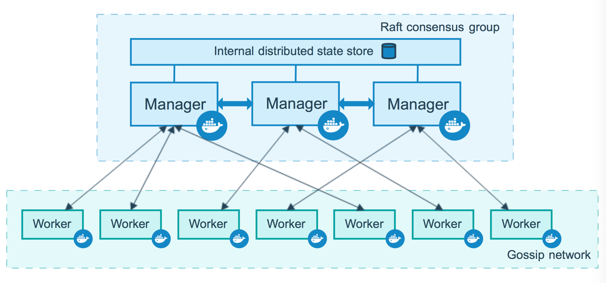

# Docker进阶（3）docker容器编排
---

---
## 1. 容器编排
我们使用docker run去启动容器其实是一个很麻烦的事情，当我们的服务之间有依赖关系，又需要启动多个容器的时候，容器的管理就是一个很大的问题，涉及到：

- 服务的创建参数问题
- 服务之间的依赖关系
- 集群部署环境下部署容器的问题

当然为了解决以上的一些问题，我们可以有一些传统的解决方案：使用shell脚本和CICD去部署容器


当然有docker-compose来进行容器的创建，然后使用docker swarm进行容器的集群搭建，不过这只适用于小范围的容器集群搭建，进行容器编排最终还是需要使用k8s 


K8S的目标是让部署容器化应用简单高效。
K8s解决了裸跑 Docker 的若干痛点:

- 单机使用，无法有效集群
- 随着容器数量的上升，管理成本攀升
- 没有有效的容灾、自愈机制
- 没有预设编排模板，无法实现快速、大规模容器调度
- 没有统一的配置管理中心工具
- 没有容器生命周期的管理工具
- 没有图形化运维管理工具

K8S提供了容器编排，资源调度，弹性伸缩，部署管理，服务发现等一系列功能。


## 2. docker compose
### 2.1 安装
官网很慢：
```
curl -L "https://github.com/docker/compose/releases/download/v2.2.2/docker-compose-$(uname -s)-$(uname -m)" -o /usr/local/bin/docker-compose
```

这里使用国内的网站下载：
```
curl -L https://get.daocloud.io/docker/compose/releases/download/v2.2.2/docker-compose-`uname -s`-`uname -m` > /usr/local/bin/docker-compose
 
chmod +x /usr/local/bin/docker-compose

 ln -s /usr/local/bin/docker-compose /usr/bin/docker-compos
 
docker-compose --help
```

学习资源：
官网：https://docs.docker.com/compose/gettingstarted/
菜鸟：https://www.runoob.com/docker/docker-compose.html

### 2.2 官方文档创建一个简单的web应用
应用说明：
使用到了redis和flask搭建的一个简单的计数器引用程序：
```
mkdir composetest
cd composetest
```
在composetest创建一下文件：

- app.py

```python
# -*- coding: utf-8 -*-
import time

import redis
from flask import Flask

app = Flask(__name__)
# 这里使用了docker network，所以host可以直接写redis
cache = redis.Redis(host='redis', port=6379)


def get_hit_count():
    retries = 5
    while True:
        try:
            return cache.incr('hits')
        except redis.exceptions.ConnectionError as exc:
            if retries == 0:
                raise exc
            retries -= 1
            time.sleep(0.5)


@app.route('/')
def hello():
    count = get_hit_count()
    return 'Hello World! I have been seen {} times.\n'.format(count)
```

- requirements.txt
python环境的依赖包文件，用pip安装
```
flask
redis
```

- Dockerfile
```dockerfile
# syntax=docker/dockerfile:1
FROM python:3.7-alpine
WORKDIR /code
ADD . /code
ENV FLASK_APP=app.py
ENV FLASK_RUN_HOST=0.0.0.0
COPY requirements.txt requirements.txt
RUN pip install -r requirements.txt -i https://pypi.tuna.tsinghua.edu.cn/simple/
EXPOSE 5000
COPY . .
CMD ["flask", "run"]
```

- docker-compose.yml
```yaml
version: "3.9"
services:
  web:
    build: .
    ports:
      - "8000:5000"
  redis:
    image: "redis:alpine"
```

配置完后的目录结构：
```
[root@localhost composetest]# ll
总用量 16
-rw-r--r-- 1 root root 632 4月  10 23:48 app.py
-rw-r--r-- 1 root root 119 4月  10 23:49 docker-compose.yml
-rw-r--r-- 1 root root 299 4月  11 00:09 Dockerfile
-rw-r--r-- 1 root root  14 4月  10 23:49 requirements.txt
```
然后直接运行，以下为运行成功：
```
[root@localhost composetest]#
[root@localhost composetest]# docker-compose up
[+] Running 2/0
 ⠿ Container composetest-web-1    Created                                                                                       0.0s
 ⠿ Container composetest-redis-1  Created                                                                                       0.0s
Attaching to composetest-redis-1, composetest-web-1
composetest-redis-1  | 1:C 10 Apr 2022 16:11:10.389 # oO0OoO0OoO0Oo Redis is starting oO0OoO0OoO0Oo
composetest-redis-1  | 1:C 10 Apr 2022 16:11:10.389 # Redis version=6.2.6, bits=64, commit=00000000, modified=0, pid=1, just started
composetest-redis-1  | 1:C 10 Apr 2022 16:11:10.389 # Warning: no config file specified, using the default config. In order to specify a config file use redis-server /path/to/redis.conf
composetest-redis-1  | 1:M 10 Apr 2022 16:11:10.390 * monotonic clock: POSIX clock_gettime
composetest-redis-1  | 1:M 10 Apr 2022 16:11:10.391 * Running mode=standalone, port=6379.
composetest-redis-1  | 1:M 10 Apr 2022 16:11:10.391 # WARNING: The TCP backlog setting of 511 cannot be enforced because /proc/sys/net/core/somaxconn is set to the lower value of 128.
composetest-redis-1  | 1:M 10 Apr 2022 16:11:10.391 # Server initialized
composetest-redis-1  | 1:M 10 Apr 2022 16:11:10.391 * Loading RDB produced by version 6.2.6
composetest-redis-1  | 1:M 10 Apr 2022 16:11:10.391 * RDB age 38 seconds
composetest-redis-1  | 1:M 10 Apr 2022 16:11:10.391 * RDB memory usage when created 0.79 Mb
composetest-redis-1  | 1:M 10 Apr 2022 16:11:10.391 # Done loading RDB, keys loaded: 1, keys expired: 0.
composetest-redis-1  | 1:M 10 Apr 2022 16:11:10.391 * DB loaded from disk: 0.000 seconds
composetest-redis-1  | 1:M 10 Apr 2022 16:11:10.391 * Ready to accept connections
composetest-web-1    |  * Serving Flask app 'app.py' (lazy loading)
composetest-web-1    |  * Environment: production
composetest-web-1    |    WARNING: This is a development server. Do not use it in a production deployment.
composetest-web-1    |    Use a production WSGI server instead.
composetest-web-1    |  * Debug mode: off
composetest-web-1    |  * Running on all addresses (0.0.0.0)
composetest-web-1    |    WARNING: This is a development server. Do not use it in a production deployment.
composetest-web-1    |  * Running on http://127.0.0.1:5000
composetest-web-1    |  * Running on http://172.18.0.2:5000 (Press CTRL+C to quit)
```

可以直接访问：
```
[root@localhost composetest]# curl localhost:8000
Hello World! I have been seen 1 times.
[root@localhost composetest]# curl localhost:8000
Hello World! I have been seen 2 times.
[root@localhost composetest]# curl localhost:8000
Hello World! I have been seen 3 times.
```

结束。

### 2.3 一个简单的wordpress博客项目
链接：https://docs.docker.com/samples/wordpress/
使用方法：
```
 cd my_wordpress/
 
 touch　docker-compose.yml
```

- docker-compose.yml
```yaml
version: "3.9"
    
services:
  db:
    image: mysql:5.7
    volumes:
      - db_data:/var/lib/mysql
    restart: always
    environment:
      MYSQL_ROOT_PASSWORD: somewordpress
      MYSQL_DATABASE: wordpress
      MYSQL_USER: wordpress
      MYSQL_PASSWORD: wordpress
    
  wordpress:
    depends_on:
      - db
    image: wordpress:latest
    volumes:
      - wordpress_data:/var/www/html
    ports:
      - "8000:80"
    restart: always
    environment:
      WORDPRESS_DB_HOST: db
      WORDPRESS_DB_USER: wordpress
      WORDPRESS_DB_PASSWORD: wordpress
      WORDPRESS_DB_NAME: wordpress
volumes:
  db_data: {}
  wordpress_data: {}
```
最后直接执行：
```
# -d是后台执行的意思
docker-compose up -d
```

然后就可以运行一个WordPress项目
```
[root@localhost my_wordpress]# docker ps
CONTAINER ID   IMAGE              COMMAND                  CREATED          STATUS          PORTS                  NAMES
7b91acc2bd12   wordpress:latest   "docker-entrypoint.s…"   15 seconds ago   Up 11 seconds   0.0.0.0:8000->80/tcp   my_wordpress-wordpress-1
65ffa38c9372   mysql:5.7          "docker-entrypoint.s…"   15 seconds ago   Up 13 seconds   3306/tcp, 33060/tcp    my_wordpress-db-1
[root@localhost my_wordpress]#
```

直接localhost:8000就可以访问网站。

卸载
==docker-compose down== 删除容器和默认网络，但保留的 WordPress 数据库。

==docker-compose down --volumes== 该命令删除容器、默认网络和 WordPress 数据库。


上述例子中，用来解析一下docker-compose.yml文件内容：
- version：对应的docker-compose的版本，与对应的docker版本。可查看[版本信息连接](https://docs.docker.com/compose/compose-file/compose-file-v3/)
- 

## 3. docker swarm与服务


链接：
- 官方文档：https://docs.docker.com/engine/swarm/
- 官方文档的swarm集群工作原理：https://docs.docker.com/engine/swarm/how-swarm-mode-works/nodes/
- 菜鸟：https://www.runoob.com/docker/docker-swarm.html




使用docker集群主要的工具：

- 使用docker swarm创建集群
- docker swarm集群至少有两个manager节点，然后swarm的配置只能在manager节点当中配置
- docker service的配置只能在manager节点进行配置，因此docker service必须在有docker swarm集群的时候使用
- docker node可以查看当前的集群节点状态
- docker network，使用swarm创建集群，会自动创建一个docker netwrok，是一个overlay的网络
```
[root@localhost ~]# docker network ls
NETWORK ID     NAME              DRIVER    SCOPE
8p8fxt4dnwnb   ingress           overlay   swarm
```
### 3.1 swarm与集群管理
- 创建集群：
```
docker swarm init --advertise-addr 192.168.199.98
```

- 加入集群
链接：[https://docs.docker.com/engine/reference/commandline/swarm_join-token/](https://docs.docker.com/engine/reference/commandline/swarm_join-token/)
创建集群会生成一个join worker的链接：
```
docker swarm join --token SWMTKN-1-65y73b2qxto5wa4e67vv1tc3wq6zbdc5o5q4e4jcgg38rn7gwa-1kkm0d9orosihst2gdikdqxee 192.168.199.98:2377
```
当然也可以通过==docker swarm join-token manager==命令生成加入manager节点的命令
```
[root@localhost ~]# docker swarm join-token manager
To add a manager to this swarm, run the following command:

    docker swarm join --token SWMTKN-1-65y73b2qxto5wa4e67vv1tc3wq6zbdc5o5q4e4jcgg38rn7gwa-1kkm0d9orosihst2gdikdqxee 192.168.199.98:2377
```
可以通过==docker swarm join-token==查看加入口令和更换新的加入口令

- 更新集群
链接：[https://docs.docker.com/engine/reference/commandline/swarm_update/](https://docs.docker.com/engine/reference/commandline/swarm_update/)
可以通过==docker swarm update==离开集群，集群离开之后，在docker node中就会看到节点状态变为down

- 离开集群
可以通过==docker swarm leave==离开集群，集群离开之后，在docker node中就会看到节点状态变为down


### 3.2 服务

创建了集群之后，可以在集群上去创建服务，首先可以使用==docker node ls==查看节点状态
```
[root@localhost ~]# docker node ls
ID                            HOSTNAME                STATUS    AVAILABILITY   MANAGER STATUS   ENGINE VERSION
6c5ur096mflllmg5uqbe04404     localhost.localdomain   Ready     Active                          20.10.12
qvufffw1ll9u38wvzsavj1mls *   localhost.localdomain   Ready     Active         Leader           20.10.2
u6ho73482hm79j09u6zrvrgsv     localhost.localdomain   Ready     Active         Reachable        20.10.2
y2b6roogo7hv4d3ur6n5pf5op     localhost.localdomain   Ready     Active                          20.10.12
```

- 添加服务
可以使用==docker service create==添加服务，并且同时定义副本数量
```
docker service create --replicas 3 -p 8888:80 --name my-nginx nginx
```
添加service之后，可以通过==docker service ls==查看服务列表：
```
[root@localhost ~]# docker service ls
ID             NAME        MODE         REPLICAS   IMAGE          PORTS
p7jur23krjp4   lca-redis   replicated   6/6        redis:latest   *:6739->6739/tcp
orirk9ffql1v   my-nginx    replicated   1/1        nginx:latest   *:8888->80/tcp
```
还可以通过==docker service ps \<servicer-name>==查看服务详情


可以使用==docker service scale==变更服务副本的数量进行扩缩容
```
docker service scale my-nginx=1
```
当然也可以使用==docker service update==，效果一样
```
docker service update --replicas 1 lca-redis
```
相对来说，==docker service update==功能更多，而==docker service scale==主要用于扩缩容

- 删除服务
使用==docker service rm==
