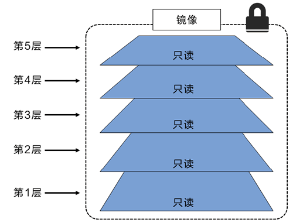
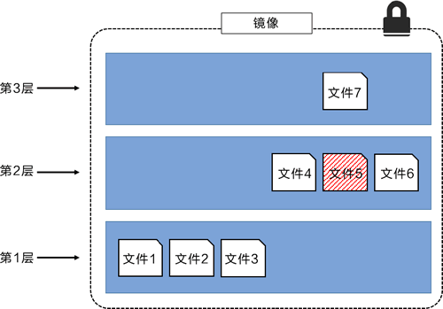

# Docker进阶
---
参考摘录自：http://c.biancheng.net/view/3130.html

---
## 1. Docker的存储驱动
### 1.1 存储驱动介绍
每个 Docker 容器都有一个本地存储空间，用于保存层叠的镜像层（Image Layer）以及挂载的容器文件系统。

- 在 Linux 上，Docker 可选择的一些存储驱动包括:
	-  AUFS（最原始也是最老的）
	-  Overlay2（可能是未来的最佳选择）
	-  Device Mapper
	-  Btrfs 
	-  ZFS
- Docker 在 Windows 操作系统上只支持一种存储驱动，即 Windows Filter。

存储驱动的选择是节点级别的。这意味着每个 Docker 主机只能选择一种存储驱动，而不能为每个容器选择不同的存储驱动。
在 Linux 上，读者可以通过修改 /etc/docker/daemon.json 文件来修改存储引擎配置，修改完成之后需要重启 Docker 才能够生效。
```
{ "storage-driver": "overlay2" }
```


如果读者修改了正在运行 Docker 主机的存储引擎类型，则现有的镜像和容器在重启之后将不可用，这是因为每种存储驱动在主机上存储镜像层的位置是不同的（通常在 /var/lib/docker/ \<storage-driver>/... 目录下）。
如果希望在切换存储引擎之后还能够继续使用之前的镜像和容器，需要将镜像保存为 Docker 格式，上传到某个镜像仓库，修改本地 Docker 存储引擎并重启，之后从镜像仓库将镜像拉取到本地，最后重启容器。

以下命令可以查看存储驱动：
```
$ docker system info
<Snip>
Storage Driver: overlay2
Backing Filesystem: xfs
Supports d_type: true
Native Overlay Diff: true
<Snip>
```

选择存储驱动并正确地配置在 Docker 环境中是一件重要的事情，特别是在生产环境中。

下面的清单可以作为一个参考指南，帮助我们选择合适的存储驱动。同时还可以参阅 Docker 官网上由 Linux 发行商提供的最新文档来做出选择。

- Red Hat Enterprise Linux：4.x版本内核或更高版本 + Docker 17.06 版本或更高版本，建议使用：Overlay2。
- Red Hat Enterprise Linux：低版本内核或低版本的 Docker，建议使用：Device Mapper。
- Ubuntu Linux：4.x 版本内核或更高版本，建议使用：Overlay2。
- Ubuntu Linux：更早的版本建议使用：AUFS。
- SUSE Linux Enterprise Server：Btrfs。


我们需要时刻关注 Docker 文档中关于存储驱动的最新支持和版本兼容列表。尤其是正在使用 Docker 企业版（EE），并且有售后支持合同的情况下，更有必要查阅最新文档。

### 1.2 Device Mapper 配置

大部分 Linux 存储驱动不需要或需要很少的配置。但是，Device Mapper 通常需要合理配置之后才能表现出良好的性能。

默认情况下，Device Mapper 采用 **loopback mounted sparse file** 作为底层实现来为 Docker 提供存储支持。实际上这个的性能非常差。


为了达到 Device Mapper 在生产环境中的最佳性能，读者需要将底层实现修改为 **direct-lvm** 模式。
这种模式下通过使用基于裸块设备（Raw Block Device）的 LVM 精简池（LVM thin pool）来获取更好的性能。

#### 让 Docker 自动设置 direct-lvm
下面的步骤会将 Docker 配置存储驱动为 Device Mapper，并使用 direct-lvm 模式。
1) 将下面的存储驱动配置添加到 /etc/docker/daemon.json 当中。 
```json
{
"storage-driver": "devicemapper",
"storage-opts": [
        "dm.directlvm_device=/dev/xdf",
        "dm.thinp_percent=95",
        "dm.thinp_metapercent=1",
        "dm.thinp_autoextend_threshold=80",
        "dm.thinp_autoextend_percent=20",
        "dm.directlvm_device_force=false"
    ]
}
```

Device Mapper 和 LVM 是很复杂的知识点，下面简单介绍一下各配置项的含义。

-    dm.directlvm_device：设置了块设备的位置。为了存储的最佳性能以及可用性，块设备应当位于高性能存储设备（如本地 SSD）或者外部 RAID 存储阵列之上。
-    dm.thinp_percent=95：设置了镜像和容器允许使用的最大存储空间占比，默认是 95%。
-    dm.thinp_metapercent：设置了元数据存储（MetaData Storage）允许使用的存储空间大小。默认是 1%。
-    dm.thinp_autoextend_threshold：设置了 LVM 自动扩展精简池的阈值，默认是 80%。
-    dm.thinp_autoextend_percent：表示当触发精简池（thin pool）自动扩容机制的时候，扩容的大小应当占现有空间的比例。
-    dm.directlvm_device_force：允许用户决定是否将块设备格式化为新的文件系统。


2) 重启 Docker。

3) 确认 Docker 已成功运行，并且块设备配置已被成功加载。

```
$ docker version
Client:
Version: 18.01.0-ce
<Snip>
Server:
Version: 18.01.0-ce
<Snip>

$ docker system info
<Snipped output only showing relevant data>
Storage Driver: devicemapper
Pool Name: docker-thinpool
Pool Blocksize: 524.3 kB
Base Device Size: 25 GB
Backing Filesystem: xfs
Data file: << Would show a loop file if in loopback mode
Metadata file: << Would show a loop file if in loopback mode
Data Space Used: 1.9 GB
Data Space Total: 23.75 GB
Data Space Available: 21.5 GB
Metadata Space Used: 180.5 kB
Metadata Space Total: 250 MB
Metadata Space Available: 250 MB
```

#### 手动配置 Device Mapper 的 direct-lvm
 1) 块设备（Block Device）
在使用 direct-lvm 模式的时候，读者需要有可用的块设备。这些块设备应该位于高性能的存储设备之上，比如本地 SSD 或者外部高性能 LUN 存储。

如果 Docker 环境部署在企业私有云（On-Premise）之上，那么外部 LUN 存储可以使用 FC、iSCSI，或者其他支持块设备协议的存储阵列。

如果 Docker 环境部署在公有云之上，那么可以采用公有云厂商提供的任何高性能的块设备（通常基于 SSD）。
2) LVM配置
Docker 的 Device Mapper 存储驱动底层利用 LVM（Logical Volume Manager）来实现，因此需要配置 LVM 所需的物理设备、卷组、逻辑卷和精简池。

读者应当使用专用的物理卷并将其配置在相同的卷组当中。这个卷组不应当被 Docker 之外的工作负载所使用。

此外还需要配置额外两个逻辑卷，分别用于存储数据和源数据信息。另外，要创建 LVM 配置文件、指定 LVM 自动扩容的触发阈值，以及自动扩容的大小，并且为自动扩容配置相应的监控，保证自动扩容会被触发。
3) Docker 配置
修改 Docker 配置文件之前要先保存原始文件（etc/docker/daemon.json），然后再进行修改。

环境中的 dm.thinpooldev 配置项对应值可能跟下面的示例内容有所不同，需要修改为合适的配置。
```
{
    "storage-driver": "devicemapper",
    "storage-opts": [
        "dm.thinpooldev=/dev/mapper/docker-thinpool",
        "dm.use_deferred_removal=true",
        "dm.use_deferred_deletion=true"
    ]
}
```
修改并保存配置后，读者可以重启 Docker daemon。


## 2. Docker引擎

### 2.1 Docker引擎组成
Docker 引擎由如下主要的组件构成：Docker 客户端（Docker Client）、Docker 守护进程（Docker daemon）、containerd 以及 runc。它们共同负责容器的创建和运行。


Docker 首次发布时，Docker 引擎由两个核心组件构成：LXC 和 Docker daemon。

Docker daemon 是单一的二进制文件，包含诸如 Docker 客户端、Docker API、容器运行时、镜像构建等。

LXC 提供了对诸如命名空间（Namespace）和控制组（CGroup）等基础工具的操作能力，它们是基于 Linux 内核的容器虚拟化技术。


### 2.2 Docker引擎迭代

#### 摆脱 LXC，使用Libcontainer 
LXC 是基于 Linux 的。这对于一个立志于跨平台的项目来说是个问题。
因此，Docker 公司开发了名为 Libcontainer 的自研工具，用于替代 LXC。

Libcontainer 的目标是成为与平台无关的工具，可基于不同内核为 Docker 上层提供必要的容器交互功能。

在 Docker 0.9 版本中，Libcontainer 取代 LXC 成为默认的执行驱动。

#### 摒弃大而全的 Docker daemon
随着时间的推移，Docker daemon 的整体性带来了越来越多的问题。Docker 公司开始努力着手拆解这个大而全的 Docker daemon 进程，并将其模块化。

这一计划遵循了在 UNIX 中得以实践并验证过的一种软件哲学：小而专的工具可以组装为大型工具。

这项拆解和重构 Docker 引擎的工作仍在进行中。不过，所有容器执行和容器运行时的代码已经完全从 daemon 中移除，并重构为小而专的工具。

目前 Docker 引擎的架构示意图如下图所示，图中有简要的描述。


#### 开放容器计划（OCI）的影响
从 Docker 1.11 版本（2016 年初）开始，Docker 引擎尽可能实现了 OCI 的规范。例如，Docker daemon 不再包含任何容器运行时的代码——所有的容器运行代码在一个单独的 OCI 兼容层中实现。

默认情况下，Docker 使用 runc 来实现这一点。runc 是 OCI 容器运行时标准的参考实现。

如上图中的 runc 容器运行时层。runc 项目的目标之一就是与 OCI 规范保持一致。

#### runc
runc 实质上是一个轻量级的、针对 Libcontainer 进行了包装的命令行交互工具（Libcontainer 取代了早期 Docker 架构中的 LXC）。

runc 生来只有一个作用——创建容器。不过它是一个 CLI 包装器，实质上就是一个独立的容器运行时工具。

因此直接下载它或基于源码编译二进制文件，即可拥有一个全功能的 runc。但它只是一个基础工具，并不提供类似 Docker 引擎所拥有的丰富功能。

有时也将 runc 所在的那一层称为“OCI 层”，如上图所示。关于 runc 的发布信息见 GitHub 中 opencontainers/runc 库的 release。

#### containerd
在对 Docker daemon 的功能进行拆解后，所有的容器执行逻辑被重构到一个新的名为 containerd（发音为 container-dee）的工具中。

它的主要任务是容器的生命周期管理——start | stop | pause | rm....

在 Kubernetes 中，containerd 就是一个很受欢迎的容器运行时。


### 2.3 启动一个新的容器过程中发生了什么?
常用的启动容器的方法就是使用 Docker 命令行工具。下面的docker container run命令会基于 alpine:latest 镜像启动一个新容器。
```
docker container run --name ctr1 -it alpine:latest sh
```
1. 当使用 Docker 命令行工具执行如上命令时，Docker 客户端会将其转换为合适的 API 格式，并发送到正确的 API 端点。
2. API 是在 daemon 中实现的。这套功能丰富、基于版本的 REST API 已经成为 Docker 的标志，并且被行业接受成为事实上的容器 API。
3. 一旦 daemon 接收到创建新容器的命令，它就会向 containerd 发出调用。daemon 已经不再包含任何创建容器的代码了！daemon 使用一种 CRUD 风格的 API，通过 gRPC 与 containerd 进行通信。
4. 虽然名叫 containerd，但是它并不负责创建容器，而是指挥 runc 去做。containerd 将 Docker 镜像转换为 **OCI bundle**，并让 runc 基于此创建一个新的容器。
5. 然后，runc 与操作系统内核接口进行通信，基于所有必要的工具（Namespace、CGroup等）来创建容器。容器进程作为 runc 的子进程启动，启动完毕后，runc 将会退出。

至此，容器启动完毕。


这样做是有好处的，将所有的用于启动、管理容器的逻辑和代码从 daemon 中移除，意味着容器运行时与 Docker daemon 是解耦的，有时称之为“无守护进程的容器（daemonless container）”，如此，对 Docker daemon 的维护和升级工作不会影响到运行中的容器。

#### shim
shim 是实现无 daemon 的容器（用于将运行中的容器与 daemon 解耦，以便进行 daemon 升级等操作）不可或缺的工具。

前面提到，containerd 指挥 runc 来创建新容器。事实上，每次创建容器时它都会 fork 一个新的 runc 实例。

不过，一旦容器创建完毕，对应的 runc 进程就会退出。因此，即使运行上百个容器，也无须保持上百个运行中的 runc 实例。

一旦容器进程的父进程 runc 退出，相关联的 containerd-shim 进程就会成为容器的父进程。作为容器的父进程，shim 的部分职责如下。

-    保持所有 STDIN 和 STDOUT 流是开启状态，从而当 daemon 重启的时候，容器不会因为管道（pipe）的关闭而终止。
-    将容器的退出状态反馈给 daemon。


## 3. 镜像操作
### 3.1 镜像标签
 
#### 镜像打多个标签
 镜像可以打多个标签指向同一个镜像ID。
 在 docker image pull 命令中指定 -a 参数来拉取仓库中的全部镜像。接下来可以通过运行 docker image ls 查看已经拉取的镜像。
 
发现 latest 标签使用的警告。latest 标签指向了 v1 标签的镜像。这意味着 latest 实际指向了两个镜像中较早的那个版本，而不是最新的版本！latest 是一个非强制标签，不保证指向仓库中最新的镜像！
 
 
 #### 过滤 docker image ls 的输出内容
 
 
 ##### 1）过滤器
 
 Docker 提供 --filter 参数来过滤 docker image ls 命令返回的镜像列表内容。
 
 Docker 目前支持如下的过滤器。
- dangling：可以指定 true 或者 false，仅返回悬虚镜像（true），或者非悬虚镜像（false）。
- before：需要镜像名称或者 ID 作为参数，返回在之前被创建的全部镜像。
- since：与 before 类似，不过返回的是指定镜像之后创建的全部镜像。
- label：根据标注（label）的名称或者值，对镜像进行过滤。docker image ls命令输出中不显示标注内容。

下面的示例只会返回悬虚（dangling）镜像。
```
$ docker image ls --filter dangling=true
REPOSITORY TAG IMAGE ID CREATED SIZE
<none> <none> 4fd34165afe0 7 days ago 14.5MB
```

名词解释：悬虚（dangling）镜像
那些没有标签的镜像被称为悬虚镜像，在列表中展示为\<none>:\<none>。

通常出现这种情况，是因为构建了一个新镜像，然后为该镜像打了一个已经存在的标签。

当此情况出现，Docker 会构建新的镜像，然后发现已经有镜像包含相同的标签，接着 Docker 会移除旧镜像上面的标签，将该标签标在新的镜像之上。

##### 2）reference 
其他的过滤方式可以使用 reference。

下面就是使用 reference 完成过滤并且仅显示标签为 latest 的示例。
```
$ docker image ls --filter=reference="*:latest"
REPOSITORY TAG IMAGE ID CREATED SIZE
alpine latest 3fd9065eaf02 8 days ago 4.15MB
test latest 8426e7efb777 3 days ago 122MB
```

可以使用 --format 参数来通过 Go 模板对输出内容进行格式化。例如，使用下面命令返回全部镜像，但是只显示仓库、标签和大小信息。
```
$ docker image ls --format "{{.Repository}}: {{.Tag}}: {{.Size}}"
dodge: challenger: 99.3MB
ubuntu: latest: 111MB
python: 3.4-alpine: 82.6MB
python: 3.5-alpine: 88.8MB
alpine: latest: 4.15MB
nginx: latest: 108MB
```

### 3.2 Docker Hub
通过 CLI 方式搜索 Docker Hub
==docker search== 命令允许通过 CLI 的方式搜索 Docker Hub。可以通过“NAME”字段的内容进行匹配，并且基于返回内容中任意列的值进行过滤。

返回的镜像中既有官方的也有非官方的。读者可以使用 --filter "is-official=true"，使命令返回内容只显示官方镜像。
```
$ docker search alpine --filter "is-official=true"
NAME DESCRIPTION STARS OFFICIAL AUTOMATED
alpine A minimal Docker.. 2988 [OK]
```
"is-automated=true"只显示自动创建的仓库。
```
$ docker search alpine --filter "is-automated=true"
NAME DESCRIPTION OFFICIAL AUTOMATED
anapsix/alpine-java Oracle Java 8 (and 7).. [OK]
frolvlad/alpine-glibc Alpine Docker image.. [OK]
kiasaki/alpine-postgres PostgreSQL docker.. [OK]
zzrot/alpine-caddy Caddy Server Docker.. [OK]
<Snip>
```

关于 ==docker search== 需要注意的最后一点是，默认情况下，Docker 只返回 25 行结果。但是，可以通过指定 --limit 参数来增加返回内容行数，最多为 100 行。

### 3.3 镜像分层

#### 概念
所有的 Docker 镜像都起始于一个基础镜像层，当进行修改或增加新的内容时，就会在当前镜像层之上，创建新的镜像层。


Docker 镜像由一些松耦合的只读镜像层组成。如下图所示。


Docker 负责堆叠这些镜像层，并且将它们表示为单个统一的对象。


查看镜像分层的方式可以通过 docker image inspect 命令。下面同样以 ubuntu:latest 镜像为例。
```
$ docker image inspect ubuntu:latest
[
{
"Id": "sha256:bd3d4369ae.......fa2645f5699037d7d8c6b415a10",
"RepoTags": [
"ubuntu:latest"

<Snip>

"RootFS": {
  "Type": "layers",
  "Layers": [
   "sha256:c8a75145fc...894129005e461a43875a094b93412",
   "sha256:c6f2b330b6...7214ed6aac305dd03f70b95cdc610",
   "sha256:055757a193...3a9565d78962c7f368d5ac5984998",
   "sha256:4837348061...12695f548406ea77feb5074e195e3",
   "sha256:0cad5e07ba...4bae4cfc66b376265e16c32a0aae9"
  ]
  }
}
]
```

==docker history== 命令显示了镜像的构建历史记录，但其并不是严格意义上的镜像分层。例如，有些 Dockerfile 中的指令并不会创建新的镜像层。比如 ENV、EXPOSE、CMD 以及 ENTRY- POINT。不过，这些命令会在镜像中添加元数据。


#### 镜像分层文件存储

举一个简单的例子，假如基于 Ubuntu Linux 16.04 创建一个新的镜像，这就是新镜像的第一层；如果在该镜像中添加 Python 包，就会在基础镜像层之上创建第二个镜像层；如果继续添加一个安全补丁，就会创建第三个镜像层。

该镜像当前已经包含 3 个镜像层，如下图所示（这只是一个用于演示的很简单的例子）。


在添加额外的镜像层的同时，镜像始终保持是当前所有镜像的组合，理解这一点非常重要。下图中举了一个简单的例子，每个镜像层包含 3 个文件，而镜像包含了来自两个镜像层的 6 个文件。


上图中的镜像层跟之前图中的略有区别，主要目的是便于展示文件。

下图中展示了一个稍微复杂的三层镜像，在外部看来整个镜像只有 6 个文件，这是因为最上层中的文件 7 是文件 5 的一个更新版本。




这种情况下，上层镜像层中的文件覆盖了底层镜像层中的文件。这样就使得文件的更新版本作为一个新镜像层添加到镜像当中。

Docker 通过存储引擎（新版本采用快照机制）的方式来实现镜像层堆栈，并保证多镜像层对外展示为统一的文件系统。下图展示了与系统显示相同的三层镜像。所有镜像层堆叠并合并，对外提供统一的视图。


### 3.4 共享镜像层
多个镜像之间可以并且确实会共享镜像层。这样可以有效节省空间并提升性能。

回顾一下之前用于拉取 nigelpoulton/tu-demo 仓库下全部包含标签的 docker image pull 命令（包含 -a 参数）。

```
$ docker image pull -a nigelpoulton/tu-demo

latest: Pulling from nigelpoulton/tu-demo
237d5fcd25cf: Pull complete
a3ed95caeb02: Pull complete
<Snip>
Digest: sha256:42e34e546cee61adb100...a0c5b53f324a9e1c1aae451e9

v1: Pulling from nigelpoulton/tu-demo
237d5fcd25cf: Already exists
a3ed95caeb02: Already exists
<Snip>
Digest: sha256:9ccc0c67e5c5eaae4beb...24c1d5c80f2c9623cbcc9b59a

v2: Pulling from nigelpoulton/tu-demo
237d5fcd25cf: Already exists
a3ed95caeb02: Already exists
<Snip>
eab5aaac65de: Pull complete
Digest: sha256:d3c0d8c9d5719d31b79c...fef58a7e038cf0ef2ba5eb74c

Status: Downloaded newer image for nigelpoulton/tu-demo

$ docker image ls
REPOSITORY TAG IMAGE ID CREATED SIZE
nigelpoulton/tu-demo v2 6ac...ead 4 months ago 211.6 MB
nigelpoulton/tu-demo latest 9b9...e29 4 months ago 211.6 MB
nigelpoulton/tu-demo v1 9b9...e29 4 months ago 211.6 MB
```
注意那些以 Already exists 结尾的行。

由这几行可见，Docker 很聪明，可以识别出要拉取的镜像中，哪几层已经在本地存在。

在本例中，Docker 首先尝试拉取标签为 latest 的镜像。然后，当拉取标签为 v1 和 v2 的镜像时，Docker 注意到组成这两个镜像的镜像层，有一部分已经存在了。出现这种情况的原因是前面 3 个镜像相似度很高，所以共享了很多镜像层。

如前所述，Docker 在 Linux 上支持很多存储引擎（Snapshotter）。每个存储引擎都有自己的镜像分层、镜像层共享以及写时复制（CoW）技术的具体实现。

