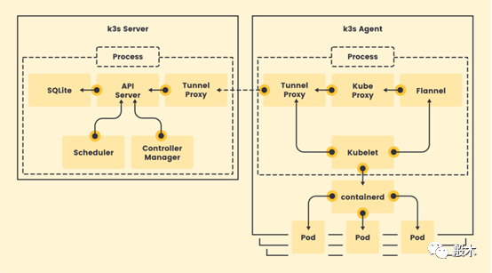

# k3s和k8s
---
---

## 1. 什么是 K3s?

K3s是Rancher实验室的一个轻量级Kubernetes发行版，是由CNCF完全认证的Kubernetes产品。在K3s中，我们看到运内存占用或集群组件的二进制文件很小。这意味着K3s的体积很小。


由于K3s的二进制文件很小，所以它是非常轻量级的，这使得安装过程更快。此外，用这种轻量级的Kubernetes部署应用程序也更快。K3s有一个基础二进制包，其大小不到100MB。由于它如此之小，我们甚至可以在Raspberry Pi（价格低廉的小型计算机硬件）中运行一个K3s集群。


K3s 工作结构（来源：K3s）


## 2. K3s的优势

- 小型

K3s 的最大优势是它的尺寸最小（小于 100 MB），这有助于它以最少的设置在小型硬件中启动 Kubernetes 集群。

- 快速部署

您可以通过一条命令在30秒内安装和部署k3s 🙃
```
curl -sfL https://get.k3s.io | sh -

# 检查就绪代码

takes maybe 30 seconds

k3s kubectl get node
```
- 轻量

K3s 由于内存占用小，非常轻量，这有助于 Kubernetes 快速启动和运行。这意味着包含运行集群所需的所有非容器化组件的二进制文件更小。

- 持续集成

K3s，由于其轻量级的环境和小尺寸，有助于持续集成。它有助于将来自多个贡献者的代码自动集成到单个项目中。

- 物联网和边缘计算的完美选择
由于支持 ARM64 和 ARMv7，K3s 对于要在资源受限的物联网设备上分发Kubernetes 非常有效。

- 简单和安全
小于 100 MB 的单个二进制文件封装了 K3s，这使得它变得简单，而且单个二进制文件易于保护，副作用更少。


## 3. 什么是K8s？

Kubernetes或K8s是最流行的管理容器的编排工具。它具有可移植性、灵活性和可扩展性，同时支持命令式/声明式配置和自动化，作为CNCF的一个毕业项目，其拥有一个庞大的生态系统。

- Kubernetes。终极指南
围绕可扩展和可靠服务的需求每天都在成倍增加。市场的驱动力是客户要求他们最喜欢的服务拥有零停机时间，而公司每停机一分钟就会损失数百万美元。

Kubernetes是为适应大规模配置（多达5000个节点）和帮助在生产环境中部署应用程序而设计的。


## 4. K8s的优势

- 可移植性

Kubernetes具有高度的可移植性，因为大量的基础资源和环境配置都使用Kubernetes。大多数其他编排器都缺乏这种可移植性，因为它们与特定的运行时或基础设施绑在了一起。

- 灵活

Kubernetes非常灵活，因为它实际上可以与任何容器运行时（运行容器的程序）一起工作。它是Kubernetes集群的一部分，它依靠CRI-O将Kubernetes与CRI（容器运行时接口）集成。但是，这种整合并不适用所有可用的容器运行时，例如runc或Rkt。它使用kubelet来调度容器。

- 多云能力

Kubernetes是供应商无关的，这意味着它可以在任何可用的基础设施上运行，包括公共云、私有云和混合云。

- 可扩展性

根据传入流量来扩展应用程序的能力是任何现代基础设施的基本功能。HPA（HorizontalPod Autoscaler）是Kubernetes中的一个内置资源，它决定了一个服务的副本数量。在Kubernetes中，弹性是一个高度自动化的核心组件。

- 开放源代码

Kubernetes是开源的，属于CNCF的范畴，因此与其他工具有更好的兼容性，也有助于整个项目在社区驱动的贡献者帮助下快速修复错误和发布。


## 5. k8s与k3s：区别

K3s在功能上与K8s没有什么不同，但它们有一些区别，使它们显得独特。K3s能比K8s更快地部署应用程序。不仅如此，K3s可以比K8s更快地启动集群。K8s是一个通用的容器编排器，而K3s是一个专门为在裸金属服务器上运行Kubernetes而打造的容器编排器。


Kubernetes使用kubelet，这是一个在每个Kubernetes节点上运行的代理，对该节点上运行的容器进行循环控制。这个代理程序在容器内运行。而K3s并不使用kubelet，它在主机上运行kubelet，使用主机的调度机制来运行容器。


同样，我们可以看到，K3S由于体积小，所以是轻量级的，这有助于它在RaspberryPi等资源有限的物联网设备中运行集群。相比之下，我们可以看到，普通的Kubernetes或K8s在物联网或边缘计算设备中是不可行的。另外，K3s同时支持ARM64和ARMv7的二进制文件结构。


Kubernetes或K8s可以托管运行于多个环境中的工作负载，而K3s只能托管在单一云中运行的工作负载。这主要是因为K3s不包含在多个云上维护复杂的工作负载的能力，因为它的规模很小。


同时，我们可以看到 Kubernetes 借助其大规模的能力，在托管工作负载和多云环境中运行集群具有优势。K3s是一个独立的服务器，与K8s不同，它是Kubernetes集群的一部分。K8s依靠CRI-O来整合Kubernetes与CRI（容器运行时接口），而K3s使用CRI-O与所有支持的容器运行时兼容。K8s使用kubelet来调度容器，但K3s使用主机的调度机制来调度容器。


K3s使用kube-proxy来代理Kubernetes节点的网络连接，但K8s使用kube-proxy来代理单个容器的网络连接。它还使用kube-proxy来设置IP伪装，而K3s不使用kube-proxy来做这个。


同样，K8s使用kubelet来监视Kubernetes节点的配置变化，而K3s不监视Kubernetes节点的配置变化。相反，它从Kubernetes控制平面接收包含配置信息的部署清单，并做出相应的改变。


当涉及到大规模数据环境的编排（自动化任务的编排和协调）时，Kubernetes非常有优势，因为它有存储大量数据的数据库和编排大量对象的能力。同时，k3s对小规模数据的情况也是比较有用的。存储在一个小于100MB的二进制文件中，这将有助于快速启动集群，更快地调度pod和其他任务。


k3s有比k8s更严格的安全部署，因为其攻击面小。k3s的另一个优势是，它可以减少安装、运行或更新Kubernetes集群所需的依赖性和步骤。


## 6. 我应该选择k3s还是k8s？

中等市值的企业可以决定同时使用K3s和K8s，因为他们不会有一个实际的S

从上面的讨论中可以看出，K3s和K8s都有其优点和缺点，这使得它们彼此之间有独特的区别。两者都非常有用，但鉴于业务情况，不同业务场景的用法会也不一样。

我们已经看到了K8s对于大型应用的好处，牢记一点，一个处理大量数据的高市值企业，其工作负载分布在多个云服务器中，应该使用K8s，这将在很多方面受益。 

中等市值的企业可以同时使用K3s和K8s，因为企业在运营过程中不会有确定的吞吐量。他们可以从使用K8s来处理大型工作负载中受益，而对于小规模生产过程中需要快速运行集群的情况，使用K3s会有更有优势。保持K3s和K8s之间的平衡可以帮助企业在保持正常运营的同时节省大量的资金。


没有任何大型应用的小市值企业可以自愿选择K3s，因为K3s在部署小工作负载的应用时非常快速，而且安装、运行和更新也很容易。 

热衷于物联网和边缘计算的独立开发者选择K3s作为他们的Kubernetes发布环境会更大优势。他们使用许多计算资源受限的硬件，如RaspberryPi和其他。我们都知道K3s是以一个小的单一二进制文件出现的，并且支持在ARM64和ARMv7的物联网设备上运行。


## 7. 最后的想法

您可能认为 k3s 比“全脂”k8s 更好，但让我提醒您 k3s 存在局限性。目前，k3s 不支持在主节点上运行除 SQLite 以外的任何其他数据库，也不支持多个主节点。因此，在选择默认容器编排器时，定义需求和目标非常重要。

我希望你在这篇文章之后对 Kubernetes 和 k3s 有相当程度的了解。如果您想学习和探索，官方教程将是一个很好的起点。


转自：https://www.modb.pro/db/161082