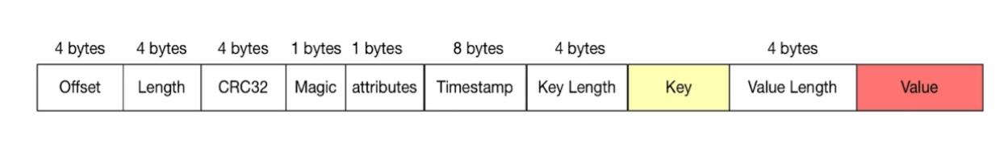

# Kafka学习手册
---
---

## 0. 预备动作
- 安装java
```
yum install java java-devel
```
下载软件包：
```
wget https://www.apache.org/dyn/closer.cgi?path=/kafka/2.7.0/kafka_2.13-2.7.0.tgz
```
解压即可，kafka依赖zookeeper进行管理。而在下载的kafka执行文件当中已经包括了zookeeper，并不需要单独安装zookeeper。

## 1. zookeeper
### 1.1 启动zookeeper
kafka本身安装包中自带了zookeeper的启动软件，kafka的集群模式依赖于zookeeper，因此需要先启动zookeeper才能启动kafka

### 1.2 使用本地的zookeeper
kafka可以使用本地的zookeeper


## 2. 安装kafka
1. 先启动zookeeper服务器：
```
bin/zookeeper-server-start.sh config/zookeeper.properties &
```

2. 然后启动kafka：
```
bin/kafka-server-start.sh config/server.properties &
```

3. 使用ps查看服务已经起来了：
```
ps -ef|grep kafka
```

4. 创建topic
```
bin/kafka-topics.sh --create --zookeeper localhost:2181 --replication-factor 1 --partitions 3 --topic lichangan-test
```
- zookeeper: 设置zookeeper的位置
- replication-factor：设置副本数是1
- partitions：设置这个topic有3个分区
- topic：设置topic名称

可以使用topic命令查看都有哪些topic
```
bin/kafka-topics.sh --list --zookeeper localhost:2181
```


5. 创建生产者
使用kafka命令：
```
bin/kafka-console-producer.sh --broker-list localhost:9092 --topic lichangan-test
```
- broker-list：指定kafka节点列表
- topic：生产消息发往的topic
就会进入一个命令交互页面，我们换一个终端窗口，建立消费者

6. 创建消费者
使用以下命令创建消费者
```
in/kafka-console-consumer.sh --bootstrap-server localhost:9092 --topic lichangan --from-beginning
```
- bootstrap-server：指定kafka节点
- topic：消费的topic
- from-beginning：从最初开始消费，即每次启动consumer的时候都会从头开始消费，如果没有这个字段，则从consumer起来的当前发送的消息开始消费

7. 发送数据
只要在producer的交互页面输入内容，consumer就能够打印出来


## 3. kafka概念
### 3.1 基本概念
- producer：消息的生产者，向kafka的一个topic发送消息
- consumer：消息的消费者，订阅kafka的topic
- consumer group：对于一个topic，可以把消息广播给多个group，但是一个group只有一个consumer会消费到数据
- broker（物理概念）：实际上就是kafka中的一个kafka节点
- topic（逻辑概念）：其实就是kafka消息的类别，对数据进行分区和隔离
- partation（物理概念）：kafka下的数据存储单元。一个topic的数据会被分分散存储到多个partation，每一个partation都是有序的。kafka会把一个partation放在一个broker内
	- 每一个topic被切分为多个partations
	- 消费者数目小于或者等于partation的数目
	- broker group中的每一个broke保存topic的一个或者多个partation，也就是说一个partation不会被多个broker保存。
	- 当一个partation非常大的时候，能够被多个broker共同存储这个partation，这种情况，每个broker保存的数据并不一样，也就是说依旧是一个partation并不会同时存在多个broker上。
	- consumer group中仅有一个consumer读取一个topic的一个或者多个partation，并且是唯一的consumer，主要是避免一个partation被多个consumer消费
- replication：同一个partation下可能有多个replica，每一个replica的数据是一样的。
	- 当集群中有broker挂掉的时候，系统可以主动的找replicas提供服务
	- 系统默认设置每一个topic的replication的系数为1，即默认不建立副本，可以在创建topic的时候单独设置
	- replication的基本单位是topic的partation
	- 所有的读和写都是从leader进，followers只是做备份
	- followers必须能够及时复制leader的数据
	- 增加容错性和可扩展性
- replication leader：再多个replica的中由replication leader负责该partation对producer与consumer交互。
- replicaManager：负责管理当前broker所有分区和副本的信息，处理kafkaController发起的一些请求，副本状态的切换、添加、读取消息等。

### 3.2 kafka Api
- producer API
- consumer API
- streams API
- connectors API

### 3.3 kafka消息格式


kafka消息字段：
- offset：记录当前消息的偏移
- length：消息有多长
- CRC32：校验消息的完整性
- magic：判定消息是不是kafka消息，如果这个magic的值和设定的不一致，那么可以快速的判定这个消息是不是当前kafka的
- attributes：可选，可以放一些属性字段，枚举值
- timestamp：时间戳
- key length：key长度
- key：key，没有长度限制
- value length：value长度
- value：value没有长度限制

### 3.4 kafka的特点
- 分布式
	- 多分区
	- 多副本
	- 多订阅者
	- 基于zookeeper调度的
- 高性能
	- 高吞吐量
	- 低延迟
	- 高并发
	- 时间复杂度O(1)
- 持久性和拓展性
	- 数据可持久化
	- 容错性能，多副本等
	- 支持在线水平拓展
	- 消息自动平衡：消息过于集中的访问某几台机器


## 4. kafka的应用场景
1. 消息队列，主要是点对点
2. 行为跟踪，发布订阅的扩展模式
3.  云信息监控，主要是操作信息，运维审计
4.  日志收集，比如ELK，HDFS等去做日志数据。用kafka可以做日志流。
5.  流处理，使用原始topic进行汇聚处理，处理完之后再发布到一个新的topic里，类似strom
6.  事件源：将状态转移按照时间序列进行排列，以实现状态回溯
7.  持久性日志（commit log），主要是使用日志回溯，让数据能够恢复


