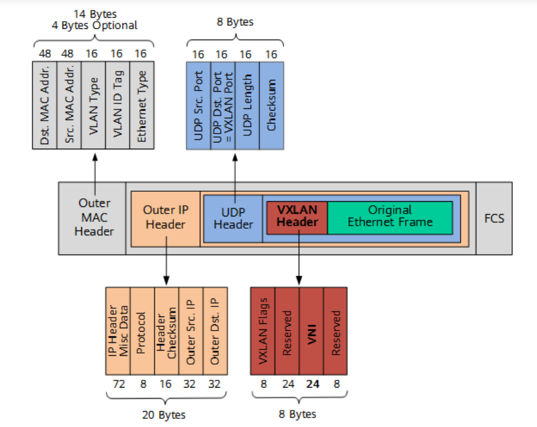

# VXLAN
---
---

看这一篇即可：
https://blog.csdn.net/weixin_39865277/article/details/110468901

问题：
1. 为什么VXLAN要用的是UDP
https://www.zhihu.com/question/54841860/answer/2257944937

2. VXLAN的报文格式

3. 怎么知道对端的VTEP的IP地址？
4. UDP的默认端口为什么是4789，源端口是随机的？
5. 配置VXLAN的时候，MTU需要注意什么？
6. VXLAN网关是什么东西？