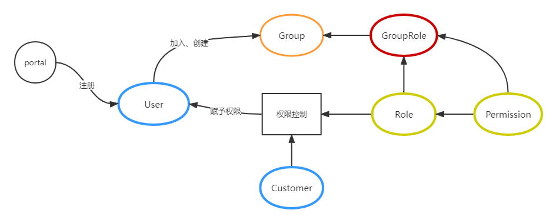

# postgresql
---
---

## 1. 安装postgresql
### 1.1 本地安装postgresql
配置repo，可以从postgresql官网上查看相关的repo链接：
https://yum.postgresql.org/packages/#pg11


```
# /etc/yum.repos.d/postgresql11.repo


[postgresql]
name=postgresql
baseurl=https://download.postgresql.org/pub/repos/yum/11/redhat/rhel-8.2-x86_64/
enabled=1
gpgcheck=0
```

直接yum（or dnf）安装数据库
```
dnf install postgresql-server postgresql-contrib postgresql-devel 
```

### 1.2 docker安装数据库
拉取postgresql镜像
```
docker pull postgres:11
```
构建docker容器：
```
mkdir -p /data
mkdir -p /data/pg_data

docker run -itd -e POSTGRES_PASSWORD=password -e POSTGRES_HOST_AUTH_METHOD=trust -v /data/pg_data/:/data -w /data --net mynet --name pgserver -p 5432:5432 postgres:11


# 进入容器
docker exec -it pgserver bash

```
- -v /media/data/data/:/data，挂载卷
- -w /data，设置工作目录
- -e POSTGRES_PASSWORD=password，设置数据库密码为password
- --net mynet：使用自定义网络，这里选填，默认参数是docker0，[docker如何添加自定义网络](https://www.cnblogs.com/aaawei/p/13402289.html)
- --name pgserver，设置容器名称为pgserver
- -p 5432:5432，发布端口

当然新建容器之后，可以使用export添加新的一些环境变量，也可以使用--env-file设置多个参数。
```
POSTGRES_PASSWORD=password
POSTGRES_HOST_AUTH_METHOD=trust  # 把本机当做可信主机，不需要输入密码
```

进入容器之后，使用psql连接数据
```
psql -U postgres 
```

当然如果宿主机安装了postgresql-client，也可以在宿主机连接数据库
```
psql -U postgres -h 127.0.0.1 -p 5432
```


## 2. 创建数据库以及数据库表设计


创建一个基于rbac的权限管理数据库表设计：


- Group（组）：每个组可以添加多个账号，组其实也是一种用户，对应不同的组角色
- User（用户账号）：账号落到租户上，一个用户可以拥有多个账号，但是一个账号同时也能被多个用户拥有
- Customer（租户）：每个租户都有唯一的UID识别，并被授予不同的角色
- GroupRole（角色）：不同角色具有不同的权限
- Role（角色）：不同角色具有不同的权限
- Permission（权限）：访问权限


对于上述的权限划分的映射关系：
- 用户帐号-组：用户帐号和组是多对多关系
- 用户账号-租户映射：用户账号和租户是多对多关系，即一个账号可以属于不同租户，一个租户也可以拥有不同的租户
- 租户-角色映射：租户和角色之间的映射关系，租户和角色是多对多关系，即一个租户可以拥有多个角色，也可以创建角色
- 角色-权限映射：角色和权限之间的映射，角色和权限是一对多关系，即一个角色拥有多个权限



- Permission表

表名：access_permission

|字段|类型|范围|描述|
| - | - | - | - |
|id|bigint||自增id|
|name|varchar(100)||权限名称|
|uid|varchar(100)||权限的唯一键，这个地方用数字显示|
|node|varchar(1000)||权限URL|
|parent_node|varchar(1000)||父权限URL|
|operation_type|varchar(30)|read、write、exec|操作分类，read或者write|
|operation|varchar(30)||操作，add、set、del等|

- Role表格
- GroupRole表格
- Customer表格
- User表格
- Group表格