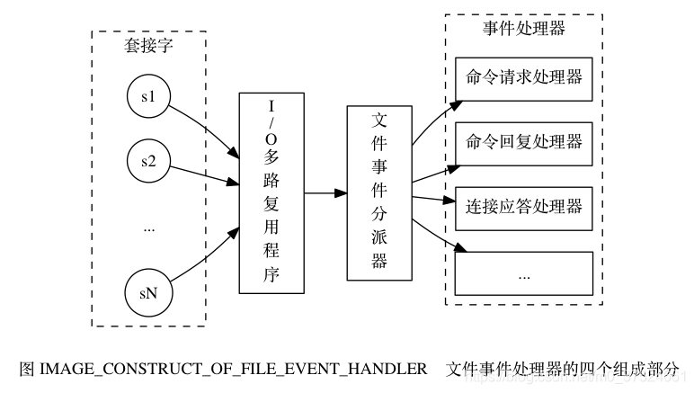
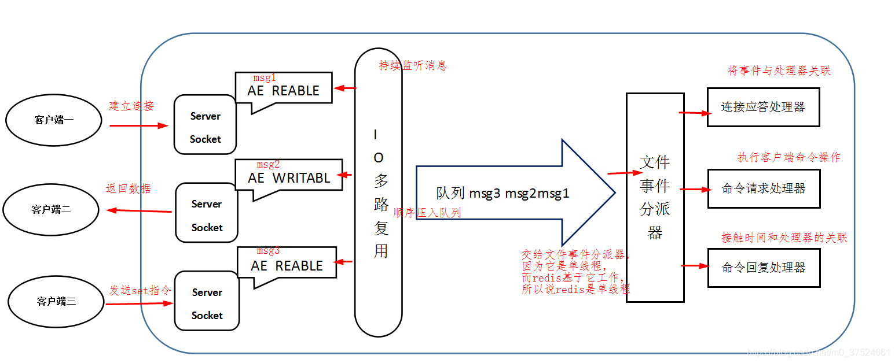

# redis面试题（二）
---
---

## 1. 如何保证缓存与数据库的双写一致性
- **问题1**：先更新数据库，再删除缓存。如果删除缓存失败了，那么会导致数据库中是新数据，缓存中是旧数据，数据就出现了不一致。
**解决思路**：**先删除缓存，再更新数据库**。如果数据库更新失败了，那么数据库中是旧数据，缓存中是空的，那么数据不会不一致。因为读的时候缓存没有，所以去读了数据库中的旧数据，然后更新到缓存中。

这种方案读取快速，但会出现短时间的脏数据，然后有了问题2。

- **问题2**：数据发生了变更，先删除了缓存，然后要去修改数据库，此时还没修改。一个请求过来，**去读缓存，发现缓存空了，去查询数据库，查到了修改前的旧数据**，放到了缓存中。随后数据变更的程序完成了数据库的修改。这时候就导致了数据库和缓存的数据不一致。
**解决思路**：写请求**先修改缓存为指定值，再去更新数据库，再更新缓存**。读请求过来后，先读缓存，**判断是指定值后进入循环状态**，等待写请求更新缓存。如果循环超时就去数据库读取数据，更新缓存。

这种方案保证了读写的一致性，但是读请求会等待写操作的完成，降低了吞吐量
## 2. 什么是缓存雪崩、缓存穿透、缓存击穿
### 2.1 缓存雪崩
描述：缓存服务器挂了，导致请求不经过缓存直接进入数据库
解决方案：
- redis 高可用，主从+哨兵，redis cluster，避免全盘崩溃。
- 本地 ehcache 缓存 + hystrix 限流&降级，避免 MySQL 被打死。
- redis 持久化，一旦重启，自动从磁盘上加载数据，快速恢复缓存数据。

### 2.2 缓存穿透
是指查询一个数据库一定不存在的数据
解决方案：
- 采用缓存空值的方式，如果从数据库中没有查询到结果，也放入到缓存中，并且设置一个较小的失效时间
- 采用布隆拦截器

### 2.3 缓存击穿
描述：某个 key 非常热点，访问非常频繁，处于集中式高并发访问的情况，当这个 key 在失效的瞬间，大量的请求就击穿了缓存，直接请求数据库，就像是在一道屏障上凿开了一个洞。
解决方案：
- 每一次请求更新一次key的过期时间
- 设置该key永久不过期
- 基于 redis or zookeeper 实现互斥锁，等待第一个请求构建完缓存之后，再释放锁，进而其它请求才能通过该 key 访问数据

### 2.4 缓存并发竞争
描述：多客户端同时并发写一个 key，可能本来应该先到的数据后到了，导致数据版本错了；或者是多客户端同时获取一个 key，修改值之后再写回去，只要顺序错了，数据就错了。
解决方案：
- 基于 zookeeper 实现分布式锁
	- (1) 每个系统通过 zookeeper 获取分布式锁，确保同一时间，只能有一个系统实例在操作某个 key，别人都不允许读和写。
	- (2) 你要写入缓存的数据，都是从 mysql 里查出来的，都得写入 mysql 中，写入 mysql 中的时候必须保存一个时间戳，从 mysql 查出来的时候，时间戳也查出来。
	- (3) 每次要写之前，先判断一下当前这个 value 的时间戳是否比缓存里的 value 的时间戳要新。如果是的话，那么可以写，否则，就不能用旧的数据覆盖新的数据。

## 3. redis底层实现-redis线程模型
### 3.1 文件事件处理器（file event handler）
redis 内部使用文件事件处理器 file event handler，这个文件事件处理器是单线程的，所以 redis 才叫做单线程的模型。
它采用[ IO 多路复用](https://www.cnblogs.com/wlwl/p/10293057.html)机制同时监听多个 socket，将产生事件的 socket 压入内存队列中，事件分派器根据 socket 上的事件类型来选择对应的事件处理器进行处理。

文件事件处理器的结构包含 4 个部分：
- 1）多个 socket
- 2）IO 多路复用程序
- 3）文件事件分派器
- 4）事件处理器（连接应答处理器、命令请求处理器、命令回复处理器）

文件事件处理器的工作流程：
- 1. 文件事件处理器使用 I/O 多路复用（multiplexing）程序来同时监听多个socket， 并根据socket目前执行的任务来为socket关联不同的事件处理器。
- 2. 多个 socket 可能会并发产生不同的操作，每个操作对应不同的文件事件，但是 IO 多路复用程序会监听多个 socket，会将产生事件的 socket 放入队列中排队。
- 3. 事件分派器每次从队列中取出一个 socket，当被监听的socket准备好执行连接应答（accept）、读取（read）、写入（write）、关闭（close）等操作时， 与操作相对应的文件事件就会产生， 这时文件事件处理器就会调用socket之前关联好的事件处理器来处理这些事件
- 4. 文件事件处理器以单线程方式运行， 但通过使用 I/O 多路复用程序来监听多个socket， 文件事件处理器既实现了高性能的网络通信模型， 又可以很好地与 redis 服务器中其他同样以单线程方式运行的模块进行对接， 这保持了 Redis 内部单线程设计的简单性。

### 3.2 Redis线程模型
上文说到，文件事件处理器的结构包含 4 个部分：
- 1）多个 socket
- 2）IO 多路复用程序
- 3）文件事件分派器
- 4）事件处理器（连接应答处理器、命令请求处理器、命令回复处理器）

Redis客户端对服务端的每次调用都经历了发送命令，执行命令，返回结果三个过程。
- 1. 其中执行命令阶段，由于Redis是单线程来处理命令的，所有每一条到达服务端的命令不会立刻执行，所有的命令都会进入一个队列中，然后逐个被执行。
- 2. 并且多个客户端发送的命令的执行顺序是不确定的。但是可以**确定的是不会有两条命令被同时执行**，不会产生并发问题，这就是Redis的单线程基本模型。

如上图所示，redis的一次通信过程：
- 1. 连接redis过程，redis 服务端进程初始化的时候，会将 server socket 的 AE_READABLE 事件与**连接应答处理器关联**。
- 2. 客户端 socket01 向 redis 进程的 server socket 请求建立连接，此时 server socket 会产生一个 AE_READABLE 事件，IO 多路复用程序监听到 server socket 产生的事件后，将该 socket 压入队列中。文件事件分派器从队列中获取 socket，交给连接应答处理器。连接应答处理器会创建一个能与客户端通信的 socket01，并将该 socket01 的 AE_READABLE 事件与命令请求处理器关联。
- 3. 假设此时客户端发送了一个 set key value 请求，此时 redis 中的 socket01 会产生 AE_READABLE 事件，IO 多路复用程序将 socket01 压入队列，此时事件分派器从队列中获取到 socket01 产生的 AE_READABLE 事件，由于前面 socket01 的 AE_READABLE 事件已经与命令请求处理器关联，因此事件分派器将事件交给命令请求处理器来处理。命令请求处理器读取 socket01 的 key value 并在自己内存中完成 key value 的设置。操作完成后，它会将 socket01 的 AE_WRITABLE 事件与命令回复处理器关联。
- 4.  如果此时客户端准备好接收返回结果了，那么 redis 中的 socket01 会产生一个 AE_WRITABLE 事件，同样压入队列中，事件分派器找到相关联的命令回复处理器，由命令回复处理器对 socket01 输入本次操作的一个结果，比如 ok，之后解除 socket01 的 AE_WRITABLE 事件与命令回复处理器的关联。

### 3.3 Redis是单线程模型为什么效率还这么高？
- 纯内存访问：数据存放在内存中，内存的响应时间大约是100纳秒，这是Redis每秒万亿级别访问的重要基础。
- 非阻塞I/O：Redis采用epoll做为I/O多路复用技术的实现，再加上Redis自身的事件处理模型将epoll中的连接，读写，关闭都转换为了时间，不在I/O上浪费过多的时间。
- 单线程避免了线程切换和竞态产生的消耗。
- Redis采用单线程模型，每条命令执行如果占用大量时间，会造成其他线程阻塞，对于Redis这种高性能服务是致命的，所以Redis是面向高速执行的数据库

### 3.4 IO多路复用技术

描述：https://www.cnblogs.com/wlwl/p/10293057.html

IO复用技术主要有以下三种：
- select
- poll
- epoll

#### select机制
客户端操作服务器时就会产生这三种文件描述符(简称fd)：writefds(写)、readfds(读)、和exceptfds(异常)。select会阻塞住监视3类文件描述符，等有数据、可读、可写、出异常 或超时、就会返回；返回后通过遍历fdset整个数组来找到就绪的描述符fd，然后进行对应的IO操作。

- 优点
几乎在所有的平台上支持，跨平台支持性好

- 缺点
由于是采用轮询方式全盘扫描，会随着文件描述符FD数量增多而性能下降。
　　每次调用 select()，需要把 fd 集合从用户态拷贝到内核态，并进行遍历(消息传递都是从内核到用户空间)
　　默认单个进程打开的FD有限制是1024个，可修改宏定义，但是效率仍然慢。

#### poll机制
基本原理与select一致，也是轮询+遍历；唯一的区别就是poll没有最大文件描述符限制（使用链表的方式存储fd）。

#### epoll机制
基本原理：
　　没有fd个数限制，用户态拷贝到内核态只需要一次，使用时间通知机制来触发。通过epoll_ctl注册fd，一旦fd就绪就会通过callback回调机制来激活对应fd，进行相关的io操作。
epoll之所以高性能是得益于它的三个函数
　　1)epoll_create()系统启动时，在Linux内核里面申请一个B+树结构文件系统，返回epoll对象，也是一个fd
　　2)epoll_ctl() 每新建一个连接，都通过该函数操作epoll对象，在这个对象里面修改添加删除对应的链接fd, 绑定一个callback函数
　　3)epoll_wait() 轮训所有的callback集合，并完成对应的IO操作
- 优点：
　　没fd这个限制，所支持的FD上限是操作系统的最大文件句柄数，1G内存大概支持10万个句柄
　　效率提高，使用回调通知而不是轮询的方式，不会随着FD数目的增加效率下降
　　内核和用户空间mmap同一块内存实现(mmap是一种内存映射文件的方法，即将一个文件或者其它对象映射到进程的地址空间)

例子：100万个连接，里面有1万个连接是活跃，我们可以对比 select、poll、epoll 的性能表现
　　select：不修改宏定义默认是1024,l则需要100w/1024=977个进程才可以支持 100万连接，会使得CPU性能特别的差。
　　poll：    没有最大文件描述符限制,100万个链接则需要100w个fd，遍历都响应不过来了，还有空间的拷贝消耗大量的资源。
　　epoll:    请求进来时就创建fd并绑定一个callback，主需要遍历1w个活跃连接的callback即可，即高效又不用内存拷贝。