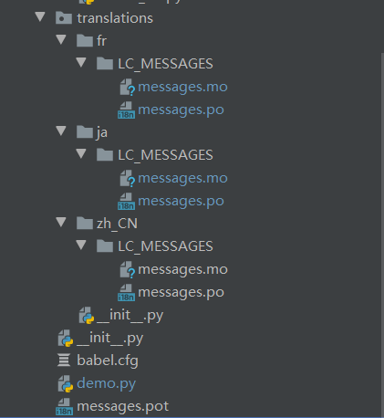

# pythonweb 国际化与本地化，支持多语言切换
---

---

## 1. 工具与名词解释
- babel：python的一个国际化组件包，官网：[bable](https://babel.pocoo.org/en/latest/)，提供了一些方便的参数，可以使用，本文以flask-babel为例：
```
pip install flask-babel
```
- gettext: 属于GUN的国际化组件
- po/pot: po文件是多语言的翻译文件，pot文件顾名思义就是po的template模板文件，里面只有msgid, 所有的msgstr都为空
- mo: mo是po文件编译之后的翻译二进制文件，gettext模块通过加载mo文件来实现翻译功能
- **国际化**：把代码中需要翻译的文本提取出来，然后进行翻译为多语言，这个过程叫做国际化，国际化流程为：
	- 1. 代码中的文本，提取为pot文件
	- 2. pot文件生成各语言的po文件，每种语言都有自己的po文件
	- 3. 再po文件中对语言进行翻译
	- 4. 把po文件编译为mo文件
- **本地化**：获取本地参数，包括时间和语言，根据本地化参数进行翻译语言，这个过程叫做本地化，web本地化一般实现：
	- 1. 通过请求的header中的accept-language字段获取本地化参数
	- 2. 通过本地化参数获取到不同的翻译文件进行翻译

## 2. 使用babel
##### 第一步：从代码中加载模板（国际化）
在对代码实现国际化，需要使用”_()“命名空间，直接使用此命名空间可能编译器会进行报错。可以直接忽略报错。只是在运行程序之前，需要确保在”_()“调用在gettext的install()方法执行之后。

注意：_()和gettext.install()是线程独立的，因此可以做语言切换使用

如python文件的下面的定义
```python
c_str = _("Hello World")
py_str = _("Hello World, %s") % "app"
```
定义babel.cfg文件，里面定义了加载哪些代码文件，将会加载“_()”命名空间的字符串
```
[python: **.py]
```
用以下命令(注意后面有个点表示路径的)，能够生成pot文件：
```commandline
pybabel extract -F babel.cfg -o messages.pot .
```
默认会生成一些自动注释，来标明是哪个代码文件第几行的字符行，实际项目中可能会产生大量的diff，**因此可以用--no-location取消生成自动注释**：
```commandline
pybabel extract --no-location -F babel.cfg -o messages.pot .
```


##### 第二步：pot生成一个po文件

一种语言对应一个po文件目录，当需要添加一种语言的时候，就需要通过pot生成对应的po，语言标识符参考：[ISO 639-1](https://baike.baidu.com/item/ISO%20639-1/8292914)：
```commandline
pybabel init -i messages.pot -d translations -l zh_CN
```
对应则会生成lang\translations\zh_CN\LC_MESSAGES\messages.po文件，这个文件和pot文件是一样的，**即当再执行一次上述的init命令之后，会导致po文件被全部刷掉，所以只允许在一种语言第一次创建的时候使用**。

而需要从pot中追加新的msgid到po文件中的时候，就需要执行以下命令：
```commandline
pybabel update -i messages.pot -d translations
```
这样会在translations下所有语言的po文件当中更新一个新的msgid，搜索这个msgid，进行翻译。（这里有遇到bug是有时会赋值一个不相关msgstr上去）

##### 第三步：翻译好的po文件生成mo文件
虽然babel支持编译的命令，但是并不推荐使用。建议使用msgfmt：
```commandline
msgfmt messages.po -o messages.mo
```
这种办法能把po文件的一些错误都打印出来。比如id重复，占位符错误等。


当然可以使用babel命令一次性对所有的translations下的po文件都进行编译为mo，执行下面的命令：
```commandline
pybabel compile -d translations
```
只是上述的命令检查机制非常有限，一些错误并不能很好的提示出来。


参考博客：[https://www.jianshu.com/p/60b5f25016b5](https://www.jianshu.com/p/60b5f25016b5)


## 3. 使用GUN gettext
- 通过pot文件生成po文件
```
msginit -l zh_CN.UTF-8 -i messages.pot -o messages.po
```

- 通过po文件生成mo文件

如果没有安装flask-babel的话，需要手动的对准pot和po文件，即复制粘贴，然后直接使用以下命令生成mo文件
```commandline
msgfmt messages.po -o messages.mo
```
只不过这个目录结构需要手动生成而已

- 使用pot文件更新po文件：

```
msgmerge -U messages.po messages.pot
```
参考：[Gettext 用于系统的国际化和本地化](http://shouce.jb51.net/linux-from-scratch-6.1.1/chapter06/gettext.html)

## 4. 多语言支持
##### 第一步：设置多个语言环境
我们以babel为例

再web开发环境中，多语言切换的场景，则需要维护多个translations文件夹，使用pot文件进行生成多种语言环境并进行翻译：
```
pybabel init -i messages.pot -d translations -l zh_CN
pybabel init -i messages.pot -d translations -l fr
pybabel init -i messages.pot -d translations -l ja
```

得到三种语言的环境：


##### 第二步：创建多个翻译对象
```python
#!/usr/bin/env python
# -*- coding: utf-8 -*-
from gettext import translation
import os

root_dir = os.path.join(os.path.dirname(__file__), "translations")

# 从 localedir/languages[x]/LC_MESSAGES/domain.mo 读取文件， localedir请传入一个绝对路径
print(root_dir)
zh_CN_translation = translation(domain="messages", localedir=root_dir, languages=["zh_CN"])
fr_translation = translation(domain="messages", localedir=root_dir, languages=["fr"])
ja_translation = translation(domain="messages", localedir=root_dir, languages=["ja"])

```

##### 第三步：从前端的请求的header获取accep-language字段：
```python
def get_locale():
    # best_match后面的列表实际上是我们当前支持的语言标识符，此方法返回的列表的内容
    return request.accept_languages.best_match(['zh_CN', 'en', 'fr', 'ja'])
```

##### 第四步：根据语言标识符，获取不同的翻译对象，并且进行翻译：
```
current_lang = get_locale()

if current_lang == 'zh_CN':
    zh_CN_translation.install()
elif current_lang == 'fr':
    fr_translation.install()
elif current_lang == 'ja':
    ja_translation.install()

c_str = _("Hello World")
py_str = _("Hello World, %s") % "app"
print(c_str)
print(py_str)
```