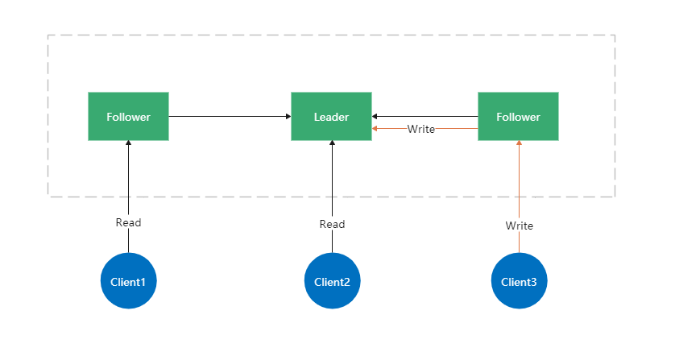
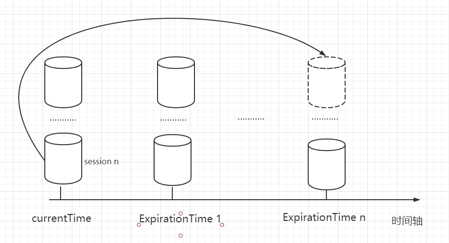

# 学习zookeeper的教程-入门
## 1. 安装zookeeper
### 1.1 先安装zookeeper，[参考链接https://www.cnblogs.com/jimcsharp/p/8358271.html](https://www.cnblogs.com/jimcsharp/p/8358271.html)

下载zookeeper
```
mkdir zookeeper
cd zookeeper
wget https://www.apache.org/dyn/closer.lua/zookeeper/zookeeper-3.6.2/apache-zookeeper-3.6.2-bin.tar.gz
tar xvf apache-zookeeper-3.6.2-bin.tar.gz
```


- bin目录
  zk的可执行脚本目录，包括zk服务进程，zk客户端，等脚本。其中，.sh是Linux环境下的脚本，.cmd是Windows环境下的脚本。
- conf目录
  配置文件目录。zoo_sample.cfg为样例配置文件，需要修改为自己的名称，一般为zoo.cfg。log4j.properties为日志配置文件。
- lib
- zk依赖的包。
- contrib目录
  一些用于操作zk的工具包。
  recipes目录
  zk某些用法的代码示例


修改配置文件：
把zoo_sample.cfg建立一个备份，命名为zoo.cfg

- tickTime
    - 时长单位为毫秒，为zk使用的基本时间度量单位。例如，1 * tickTime是客户端与zk服务端的心跳时间，2 * tickTime是客户端会话的超时时间。
    - tickTime的默认值为2000毫秒，更低的tickTime值可以更快地发现超时问题，但也会导致更高的网络流量（心跳消息）和更高的CPU使用率（会话的跟踪处理）。
- clientPort
    - zk服务进程监听的TCP端口，默认情况下，服务端会监听2181端口。
- dataDir
    - 无默认配置，必须配置，用于配置存储快照文件的目录。如果没有配置dataLogDir，那么事务日志也会存储在此目录。


### 1.2 启动zookeeper

在Linux环境下，进入bin目录，执行命令
```
./zkServer.sh start ../conf/zoo.cfg
```
这个命令使得zk服务进程在后台进行。如果想在前台中运行以便查看服务器进程的输出日志，可以通过以下命令运行：
```
./zkServer.sh start-foreground
```
执行此命令，可以看到大量详细信息的输出，以便允许查看服务器发生了什么。

使用vim打开zkServer.sh文件，可以看到其会zkEnv.sh脚本。zkEnv脚本的作用是设置zk运行的一些环境变量，例如配置文件的位置和名称等。

### 1.3 使用systemctl管理zookeeper
当然也可以把zookeeper使用systemctl接管。
在/usr/lib/systemd/system下创建文件zookeeper.service，编辑文件内容：
```ini
[Unit]
Description=Zookeeper Service unit Configuration
After=network.target

[Service]
Type=forking
PIDFile=/tmp/zookeeper/zookeeper_server.pid
Environment=JAVA_HOME=/usr/lib/jvm/java-1.8.0-openjdk-1.8.0.275.b01-1.el8_3.x86_64/bin
ExecStart=/opt/zookeeper/bin/zkServer.sh start /opt/zookeeper/conf/zoo.cfg
ExecStop=/opt/zookeeper/bin/zkServer.sh stop
ExecStartPre=/usr/bin/rm -f /tmp/zookeeper/zookeeper_server.pid
ExecReload=/bin/kill -s HUP $MAINPID
KillMode=none
User=root
Group=root
Restart=on-failure
[Install]
WantedBy=multi-user.target
```
其中的：
- PIDFile：为zoo.cfg中定义的dataDir目录下的zookeeper_server.pid
- Environment：需要依赖java环境
- ExecStart：启动脚本
- ExecStop：关闭脚本
- ExecStartPre：启动前准备


保存文件后，执行：
```
systemctl daemon-reload  # 更新unit文件
systemctl enable zookeeper  # 开机启动（如果有需要的话）
systemctl start zookeeper  # 启动程序
```

### 1.4 连接zookeeper
zk分为server和client，它们的作用是：
- server：服务端运行在集群的每台机器当中，在集群中提供服务。 
- client：客户端是集群外的访问，服务端才是集群上的提供服务的。  


使用bin/zkServer.sh start开启的zookeeper上的一个服务端，而使用bin/zkCli.sh是将客户端连到服务端上。

客户端可以通过服务端创建znode,删除znode，写znode,读znode，设置监视等等。

其中zookeeper提供的master选举选的是客户端的master，根据他们登录后在GroupMember目录下创建的临时目录的id来选的，最小的是master。  

这就区别于集群中服务端的各个servers的角色了，servers角色是leader和follow（或者还有observer）。 简而言之，客户端通过服务端来获取到zookeeper提供的服务。


## 2. 搭建zookeeper集群

上述只是一个简单的zookeeper安装过程，我们玩zookeeper还是要搭建zookeeper集群玩。可以使用docker搭建伪集群
### 2.1 docker搭建zk集群
```
# 拉取镜像
docker pull zookeeper

# 启动三个zk容器
docker run -d --name=zk1 -v /config/zk1:/conf -p 2181:2181 zookeeper:3.7
docker run -d --name=zk2 -v /config/zk2:/conf -p 2182:2181 zookeeper:3.7
docker run -d --name=zk3 -v /config/zk3:/conf -p 2183:2181 zookeeper:3.7
```

我们使用docker inspect <容器名称>查看容器IP：
```
[root@localhost config]# docker inspect zk1 |grep IPAddress
            "SecondaryIPAddresses": null,
            "IPAddress": "172.17.0.2",
                    "IPAddress": "172.17.0.2",
```

从上述启动容器中可以看到zk的配置文件被映射到了/config下，更改三个配置文件为如下：
```
dataDir=/data
dataLogDir=/datalog
tickTime=2000
initLimit=5
syncLimit=2
autopurge.snapRetainCount=3
autopurge.purgeInterval=0
maxClientCnxns=60
standaloneEnabled=true
admin.enableServer=true
server.1=172.17.0.2:2888:3888;2181
server.2=172.17.0.3:2888:3888;2181
server.3=172.17.0.4:2888:3888;2181
```

进入容器内部更改每一个容器的myid：
```
docker exec -it zk1 bash
zk1: echo 1 > /data/myid

docker exec -it zk2 bash
zk2: echo 2 > /data/myid

docker exec -it zk3 bash
zk3: echo 3 > /data/myid
```

重启容器
```
docker restart zk1 zk2 zk3
```

使用如下命令查看节点状态
```
echo stat | nc 172.17.0.2 2181
```
自此已经建立了zookeeper节点


### zookeeper的名词解释

多台Zookeeper节点组成Zookeeper集群，主要有Leader和Follower。

- Leader
是Zookeeper集群的核心组件
集群中各个服务器的调度者
事务（写操作）请求的唯一调度和处理者，保证集群处理事务的顺序性；对于新增、更新、删除等写操作，统一由leader来进行编号并处理；这一过程称为一个事务。
Leader并不是由用户指定的，而是服务启动之后，各个节点投票选举产生的
- Follower
处理非事务(读操作)请求
转发事务（写操作）请求给Leader
参与集群中Leader的选举
初次之外，针对访问量大的Zookeeper集群，还可以新增观察员角色。

- Observer
观察Zookeeper集群的最新状态变化并将这些状态同步过来，可以处理非事务请求，事务请求会转发给Leader进行处理
不会参与投票选举，通常用于在不影响集群事务处理能力的前提下提升集群的非事务处理能力，提高集群并发的读能力。

##### Zookeeper的特点
全局数据一致，每个节点保存一份相同的数据副本，client无论连接到哪个节点数据都是一致的
Leader负责进行投票的发起和决议，更新系统状态（后文会详解）
Follower用于接收客户请求并向客户端返回结果，在选举Leader过程中参与投票
只要有半数以上节点存活，Zookeeper集群就能正常服务
更新的请求是顺序执行的
数据更新具有原子性，一次数据更新要么成功，要么失败会返回给client一个明确的结果
Leader和Follower是主从架构，一个主节点(leader)多个从节点(follower)


## 3. zookeeper事务

所谓的事务就是增删改查操作，实际的操作可以通过zookeeper内置的命令行工具zkCli.sh进行操作

当然也可以通过各类语言的api，这里使用的py：

代码目录：[代码](./zookeeper-demo/zoo_util.py)
参考博客：[博客](https://www.jianshu.com/p/58791beb40be)

每一次事务操作都会有当前的事务id

注意，delete 命令只能一层一层删除，想要递归的删除，应该使用新版本可以通过 deleteall 命令递归删除（3.5以后）

### 3.1 zk如何处理分布式事务
ZooKeeper 实现分布式事务，类似于两阶段提交，总共分为以下 4 步：

1. 客户端先给 ZooKeeper 节点发送写请求；
2. ZooKeeper 节点将写请求转发给 Leader 节点，Leader 广播给集群要去投票，等待确认；
3. Leader 收到确认，统计投票，票数过半则提交事务；
4. 事务提交成功后，ZooKeeper 节点告知客户端。

### 3.2 zk的事务id和和数据模型

#### 3.2.1 znode
ZNode是ZooKeeper中数据的最小单元,每个 ZNode上都可以保存数据,同时还可以挂载子节点,因此构成了一个层次化的命名空间,我们称之为树。

类似linux的文件树


参考博客：https://blog.csdn.net/cold___play/article/details/106096999


#### 3.2.2 事务ID
在ZooKeeper中，事务是指能够改变ZooKeeper服务器状态的操作，我们也称之为事务操作或更新操作，一般包括数据节点创建与删除、数据节点内容更新和客户端会话创建与失效等操作。

对于每一个事务请求,ZooKeeper都会为其分配一个全局唯一的事务ID,用ZXID来表示，通常是一个64位的数字。每一一个ZXID对应一次更新操作，从这些ZXID中可以间接地识别出ZooKeeper处理这些更新操作请求的全局顺序。

#### 3.2.3 watch 机制，监听节点变化
事件监听机制类似于观察者模式，watch 流程是客户端向服务端某个节点路径上注册一个 watcher，同时客户端也会存储特定的 watcher，当节点数据或子节点发生变化时，服务端通知客户端，客户端进行回调处理。特别注意：监听事件被单次触发后，事件就失效了。

提示：参考常用命令章节 get 命令监听 watch 使用，后面章节将详细介绍 watch 实现原理。

#### 3.2.4 节点类型
在ZooKeeper中，每个数据节点都是有生命周期的，其生命周期的长短取决于数据节点的节点类型。在ZooKeeper中，节点类型可以分为持久节点(PERSISTENT)、临时节点( EPHEMERAL)和顺序节点(SEQUENTIAL) 三大类，具体在节点创建过程中，通过组合使用，可以生成以下四种组合型节点类型:


- 持久节点（PERSISTENT）
持久节点是ZooKeeper中最常见的一种节点类型。所谓持久节点，是指该数据节点被创建后，就会一直存在于ZooKeeper服务器上，直到有删除操作来主动清除这个节点。

- 持久顺序节点（PERSISTENT_SEQUENTIAL）
持久顺序节点的基本特性和持久节点是一致的，额外的特性表现在顺序性上。在ZooKeeper中，每个父节点都会为它的第一级子节点维护一份顺序，用于记录下每个子节点创建的先后顺序。基于这个顺序特性，在创建子节点的时候，可以设置这个标记，那么在创建节点过程中，ZooKeeper会自动为给定节点名加上一个数字后缀，作为一个新的、完整的节点名。**另外需要注意的是，这个数字后缀的上限是整型的最大值。**

- 临时节点（EPHEMERAL）
和持久节点不同的是，临时节点的生命周期和客户端的会话绑定在一起，也就是说，如果客户端会话失效，那么这个节点就会被自动清理掉。**注意，这里提到的是客户端会话失效，而非TCP连接断开**。另外，ZooKeeper规定了不能基于临时节点来创建子节点，即临时节点只能作为叶子节点。

- 临时顺序节点（EPHEMERAL_SEQUENTIAL）
临时顺序节点的基本特性和临时节点也是一致的，同样是在临时节点的基础上，添加了顺序的特性。

#### 3.2.5 状态信息
事实上，每个数据节点除了存储了数据内容之外，还存储了数据节点本身的一些状态信息。

- cZxid	创建节点时的事务ID
- ctime	创建节点时的时间
- mZxid	最后修改节点时的事务ID
- mtime	最后修改节点时的时间
- pZxid	表示该节点的子节点列表最后一次修改的事务ID，添加子节点或删除子节点就会影响子节点列表，但是修改子节点的数据内容则不影响该ID（注意，只有子节点列表变更了才会变更pzxid，子节点内容变更不会影响pzxid）
- cversion	子节点版本号，子节点每次修改版本号加1
- dataversion	数据版本号，数据每次修改该版本号加1
- aclversion	权限版本号，权限每次修改该版本号加1
- ephemeralOwner	创建该临时节点的会话的sessionID。（**如果该节点是持久节点，那么这个属性值为0）**
- dataLength	该节点的数据长度
- numChildren	该节点拥有子节点的数量（只统计直接子节点的数量）

使用stat命令来获取一个数据节点的内容：

进入./zkCli.sh
```
[zk: localhost:2181(CONNECTED) 9] stat /lichangan
cZxid = 0x20000000c
ctime = Wed Jun 08 15:05:36 UTC 2022
mZxid = 0x20000000c
mtime = Wed Jun 08 15:05:36 UTC 2022
pZxid = 0x20000001d
cversion = 2
dataVersion = 0
aclVersion = 0
ephemeralOwner = 0x0
dataLength = 21
numChildren = 2
```

### 3.3 zk版本

ZooKeeper中为数据节点引入了版本的概念，每个数据节点都具有三种类型的版本信息，对数据节点的任何更新操作都会引起版本号的变化。

- dataVersion，当前数据节点数据内容的版本号
- cversion，当前数据节点子节点的版本号
- aclVersion，当前数据节点数据变更的ACL版本号

ZooKeeper中的版本概念和传统意义上的软件版本有很大的区别，**它表示的是对数据节点的数据内容、子节点列表，或是节点ACL信息的修改次数**，我们以其中的version 这种版本类型为例来说明。在一个数据节点/zk-book被创建完毕之后，节点的version 值是0,表示的含义是“当前节点自从创建之后，被更新过0次”。如果现在对该节点的数据内容进行更新操作，那么随后，version的值就会变成1。同时需要注意的是，在上文中提到的关于version的说明，其表示的是对数据节点数据内容的变更次数，强调的是变更次数，**因此即使前后两次变更并没有使得数据内容的值发生变化，version的值依然会变更。**

zookeeper的version主要是解决的是分布式下的数据同步问题，即一致性问题。类似数据库事务的一致性问题。

一个多线程应用，**尤其是分布式系统，在运行过程中往往需要保证数据访问的排他性**。例如在最常见的车站售票系统上，在对系统中车票“剩余量”的更新处理中，我们希望在针对某个时间点的数据进行更新操作时(这可能是一个极短的时间间隔，例如几秒或几毫秒，甚至是几纳秒，在计算机科学的有些应用场景中，几纳秒可能也算不上太短的时间间隔)，数据不会因为其他人或系统的操作再次发生变化。也就是说，车站的售票员在卖票的过程中，必须要保证在自己的操作过程中，其他售票员不会同时也在出售这个车次的车票。

这个排他性其实就是“锁”的概念。

在并发环境中，我们需要通过一些机制来保证这些数据在某个操作过程中不会被外界修改，我们称这样的机制为“锁”。在数据库技术中，通常提到的“悲观锁”和“乐观锁”就是这种机制的典型实现。

事实上，在ZooKeeper中，version属性正是用来实现乐观锁机制中的“写入校验”的。在ZooKeeper服务器的PrepRequestProcessor处理器类中，在处理每一个 数据更新(setDataRequest) 请求时，会进行如下所示的版本检查。

```java
//setData版本检查
version = setDataRequest.getVersion();
int currentVersion = nodeRecord.stat.getVersion();
if (version != -1 && version != currentVersion) {
	throw new KeeperException.BadVersionException(path);
}
version = currentVersion + 1;
```
从上面的执行逻辑中，我们可以看出，在进行一次setDataRequest请求处理时，首先进行了版本检查:ZooKeeper会从setDataRequest请求中获取到当前请求的版本version, 同时从数据记录nodeRecord中获取到当前服务器上该数据的最新版本currentVersion:

- "如果version为“-1”， 那么说明客户端并不要求使用乐观锁，可以忽略版本比对;
- 如果version不是“-1”, 那么就比对version和currentVersion,如果两个版本不匹配，那么将会抛出BadVersionException异常。


以下是相关阅读：

- **悲观锁**
又被称作悲观并发控制(Pessimistic Concurrency Control, PCC)，是数据库中一种非常典型且非常严格的并发控制策略。悲观锁具有强烈的独占和排他特性，能够有效地避免不同事务对同–数据并发更新而造成的数据一致性问题。
在悲观锁的实现原理中，如果一个事务(假定事务A)正在对数据进行处理，那么在整个处理过程中，都会将数据处于锁定状态，在这期间，其他事务将无法对这个数据进行更新操作，直到事务A完成对该数据的处理，释放了对应的锁之后，其他事务才能够重新竞争来对数据进行更新操作。
也就是说，对于一份独立的数据，系统只分配了一把唯一的钥匙，谁获得了这把钥匙，谁就有权力更新这份数据。一般我们认为，在实际生产应用中，悲观锁策略适合解决那些对于数据更新竞争十分激烈的场景一在这类场景中，通常采用简单粗暴的悲观锁机制来解决并发控制问题。

- **乐观锁**
又被称作乐观并发控制(Optimistic Concurrency Control, OCC)， 也是一种常见的并发控制策略。相对于悲观锁而言，乐观锁机制显得更加宽松与友好。
从上面对悲观锁的讲解中我们可以看到，悲观锁假定不同事务之间的处理一定会出现互相干扰，从而需要在一个事务从头到尾的过程中都对数据进行加锁处理。
而乐观锁则正好相反，它假定多个事务在处理过程中不会彼此影响，因此在事务处理的绝大部分时间里不需要进行加锁处理。当然，既然有并发，就一定会存在数据更新冲突的可能。在乐观锁机制中,在更新请求提交之前，每个事务都会首先检查当前事务读取数据后，是否有其他事务对该数据进行了修改。如果其他事务有更新的话，那么正在提交的事务就需要回滚。乐观锁通常适合使用在数据并发竞争不大、事务冲突较少的应用场景中。


相关阅读：[数据库如何实现乐观锁和悲观锁？](https://m.php.cn/article/480427.html)


## 4. zk的session管理

客户端与服务端之间的连接是基于 TCP 长连接，client 端连接 server 端默认的 2181 端口，也就是 session 会话。

从第一次连接建立开始，客户端开始会话的生命周期，客户端向服务端的ping包请求，每个会话都可以设置一个超时时间。

### 4.1 Session 的创建
sessionID: 会话ID，用来唯一标识一个会话，每次客户端创建会话的时候，zookeeper 都会为其分配一个全局唯一的 sessionID。zookeeper 创建 sessionID 类 SessionTrackerImpl 中的源码。
```java
    /**
     * Generates an initial sessionId.
     *
     * <p>High order 1 byte is serverId, next 5 bytes are from timestamp, and low order 2 bytes are 0s.
     * Use {@literal ">>> 8"}, not {@literal ">> 8"} to make sure that the high order 1 byte is entirely
     * up to the server Id.
     *
     * <p>See also http://jira.apache.org/jira/browse/ZOOKEEPER-1622
     *
     * @param id server Id
     * @return the session Id
     */
    public static long initializeNextSessionId(long id) {
        long nextSid;
        nextSid = (Time.currentElapsedTime() << 24) >>> 8;
        nextSid = nextSid | (id << 56);
        if (nextSid == EphemeralType.CONTAINER_EPHEMERAL_OWNER) {
            ++nextSid;  // this is an unlikely edge case, but check it just in case
        }
        return nextSid;
    }
```

- Timeout：会话超时时间。客户端在构造 Zookeeper 实例时候，向服务端发送配置的超时时间，server 端会根据自己的超时时间限制最终确认会话的超时时间。

- TickTime：下次会话超时时间点，默认 2000 毫秒。可在 zoo.cfg 配置文件中配置，便于 server 端对 session 会话实行分桶策略管理。

- isClosing：该属性标记一个会话是否已经被关闭，当 server 端检测到会话已经超时失效，该会话标记为"已关闭"，不再处理该会话的新请求。

### 4.2 Session 的状态
下面介绍几个重要的状态：

- connecting：连接中，session 一旦建立，状态就是 connecting 状态，时间很短。
- connected：已连接，连接成功之后的状态。
- closed：已关闭，发生在 session 过期，一般由于网络故障客户端重连失败，服务器宕机或者客户端主动断开。

### 4.3 会话超时管理（分桶策略+会话激活）
zookeeper 的 leader 服务器再运行期间定时进行会话超时检查，时间间隔是 ExpirationInterval，单位是毫秒，默认值是 tickTime，每隔 tickTime 进行一次会话超时检查。


ExpirationTime 的计算方式:
```java
ExpirationTime = CurrentTime + SessionTimeout;
ExpirationTime = (ExpirationTime / ExpirationInterval + 1) * ExpirationInterval;
```
在 zookeeper 运行过程中，客户端会在会话超时过期范围内向服务器发送请求（包括读和写）或者 ping 请求，俗称心跳检测完成会话激活，从而来保持会话的有效性。

会话激活流程：


激活后进行迁移会话的过程，然后开始新一轮

