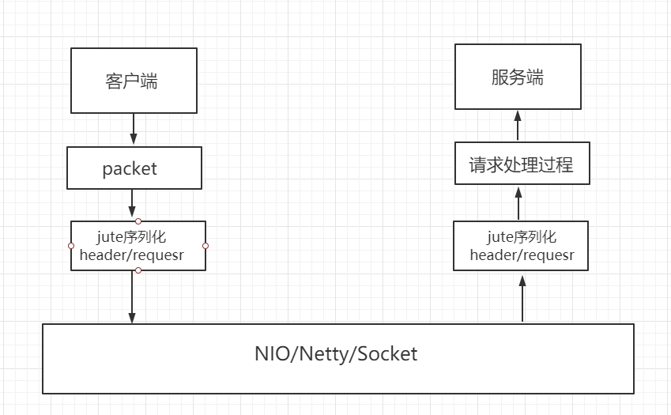
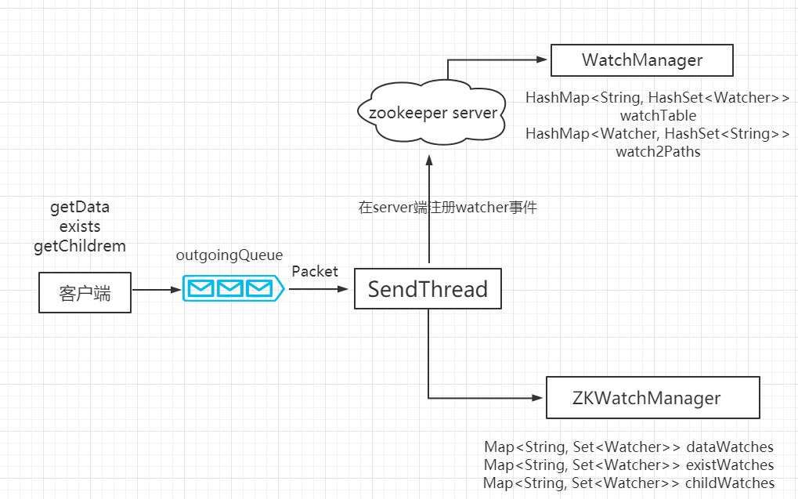
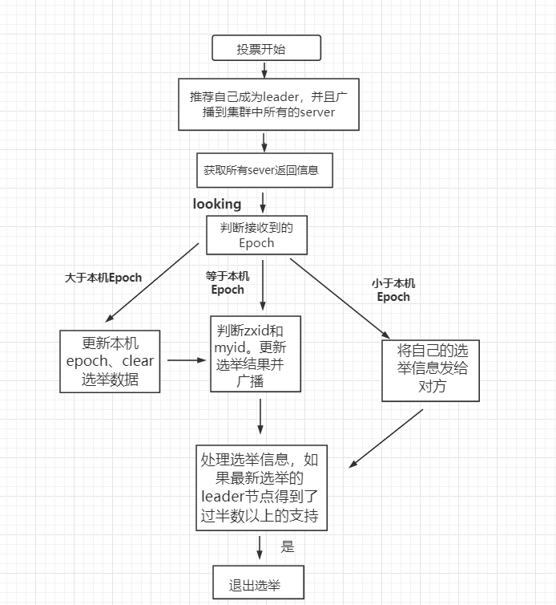

# 学习zookeeper的教程-进阶

## 1. 四字命令

zookeeper 支持某些特定的四字命令与其交互，用户获取 zookeeper 服务的当前状态及相关信息，用户在客户端可以通过 telenet 或者 nc（netcat） 向 zookeeper 提交相应的命令。

```
# 安装 nc 命令：
yum install nc                # centos
```

四字命令格式：
```
echo [command] | nc [ip] [port]
```

最简单的，比如查看zk节点状态：
```
[root@localhost ~]# echo stat | nc 172.17.0.2 2181
Zookeeper version: 3.7.0-e3704b390a6697bfdf4b0bef79e3da7a4f6bac4b, built on 2021-03-17 09:46 UTC
Clients:
 /172.17.0.1:42690[0](queued=0,recved=1,sent=0)

Latency min/avg/max: 0/0.6499/48
Received: 438
Sent: 437
Connections: 1
Outstanding: 0
Zxid: 0x300000004
Mode: follower
Node count: 8
```

ZooKeeper 常用四字命令主要如下：

- **conf**：	3.3.0版本引入的。打印出服务相关配置的详细信息。
- **cons**：	3.3.0版本引入的。列出所有连接到这台服务器的客户端全部连接/会话详细信息。包括"接受/发送"的包数量、会话id、操作延迟、最后的操作执行等等信息。
- **crst**：	3.3.0版本引入的。重置所有连接的连接和会话统计信息。
- **dump**：	列出那些比较重要的会话和临时节点。这个命令只能在leader节点上有用。
- **envi**：	打印出服务环境的详细信息。
- **reqs**：	列出未经处理的请求
- **ruok**：	测试服务是否处于正确状态。如果确实如此，那么服务返回"imok"，否则不做任何相应。
- **stat**：	输出关于性能和连接的客户端的列表。
- **srst**：	重置服务器的统计。
- **srvr**：	3.3.0版本引入的。列出连接服务器的详细信息
- **wchs**：	3.3.0版本引入的。列出服务器watch的详细信息。
- **wchc**：	3.3.0版本引入的。通过session列出服务器watch的详细信息，它的输出是一个与watch相关的会话的列表。
- **wchp**：	3.3.0版本引入的。通过路径列出服务器watch的详细信息。它输出一个与session相关的路径。
- **mntr**：	3.4.0版本引入的。输出可用于检测集群健康状态的变量列表

参考官方链接：https://zookeeper.apache.org/doc/current/zookeeperAdmin.html#sc_4lw

## 2. zk 权限控制 ACL

zookeeper 的 ACL（Access Control List，访问控制表）权限在生产环境是特别重要的，所以本章节特别介绍一下。

ACL 权限可以针对节点设置相关读写等权限，保障数据安全性。

permissions 可以指定不同的权限范围及角色。

### 2.1 ACL 命令行
- getAcl 命令：获取某个节点的 acl 权限信息。
- setAcl 命令：设置某个节点的 acl 权限信息。
- addauth 命令：输入认证授权信息，注册时输入明文密码，加密形式保存。

### 2.2 ACL 构成
zookeeper 的 acl 通过 [scheme:id:permissions] 来构成权限列表。

- 1、**scheme**：代表采用的某种权限机制，包括
	- **world**，查看默认节点权限，再更新节点 permissions 权限部分为 crwa，结果删除节点失败。其中 world 代表开放式权限。
	- **auth**，用于授予权限，注意需要先创建用户。
	- **digest**，退出当前用户，重新连接终端，digest 可用于账号密码登录和验证。。
	- **ip**，限制 IP 地址的访问权限，把权限设置给 IP 地址为 192.168.3.7 后，IP 为 192.168.3.38 已经没有访问权限。
	- **super**，zookeeper的权限管理模式有一种叫做super，该模式提供一个超管可以方便的访问任何权限的节点。例如在忘记密码时，可以通过超管来对节点进行操作。
- 2、**id**：代表允许访问的用户。
- 3、**permissions**：权限组合字符串，由 cdrwa 组成，其中每个字母代表支持不同权限。
	- 创建权限create(c)
	- 删除权限 delete(d)
	- 读权限 read(r)
	- 写权限 write(w)
	- 管理权限admin(a)

#### （1）world

```
[zk: localhost:2181(CONNECTED) 10] getAcl /node1 
'world,'anyone
: cdrwa
# 删除c权限，创建子节点失败
[zk: localhost:2181(CONNECTED) 12] setAcl /node1 world:anyone:drwa
[zk: localhost:2181(CONNECTED) 14] create /node1/node13 "node13"
Insufficient permission : /node1/node13
# 删除d权限，删除子节点失败
[zk: localhost:2181(CONNECTED) 15] setAcl /node1 world:anyone:rwa
[zk: localhost:2181(CONNECTED) 16] delete /node1/node12
Insufficient permission : /node1/node12
# 删除r权限，获取节点数据失败，且读取子节点列表失败
[zk: localhost:2181(CONNECTED) 17] setAcl /node1 world:anyone:wa
[zk: localhost:2181(CONNECTED) 18] get /node1 
org.apache.zookeeper.KeeperException$NoAuthException: KeeperErrorCode = NoAuth for /node1
[zk: localhost:2181(CONNECTED) 40] ls /node1 
Insufficient permission : /node1
# 删除w权限，修改节点数据失败
[zk: localhost:2181(CONNECTED) 20] setAcl /node1 world:anyone:a
[zk: localhost:2181(CONNECTED) 21] set /node1 "node1234"
Insufficient permission : /node1
# 删除a权限，查看设置权限管理失败
[zk: localhost:2181(CONNECTED) 22] setAcl /node1 world:anyone:
[zk: localhost:2181(CONNECTED) 23] getAcl /node1 
Insufficient permission : /node1
```

#### （2）auth
auth 用于授予权限，注意需要先用addauth创建用户。

```
[zk: localhost:2181(CONNECTED) 16] create /node3
Created /node3
[zk: localhost:2181(CONNECTED) 17] addauth digest user:123456
[zk: localhost:2181(CONNECTED) 18] setAcl /node3 auth:user:123456:cdrwa
[zk: localhost:2181(CONNECTED) 20] getAcl /node3
'digest,'user:6DY5WhzOfGsWQ1XFuIyzxkpwdPo=
: cdrwa
[zk: localhost:2181(CONNECTED) 21] get /node3
null
# 退出客户端重新登录
[zk: localhost:2181(CONNECTED) 0] whoami
Auth scheme: User
ip: 127.0.0.1
[zk: localhost:2181(CONNECTED) 1] get /node3
org.apache.zookeeper.KeeperException$NoAuthException: KeeperErrorCode = NoAuth for /node3
[zk: localhost:2181(CONNECTED) 2] addauth digest user:123456
[zk: localhost:2181(CONNECTED) 3] get /node3
null
[zk: localhost:2181(CONNECTED) 4] whoami
Auth scheme: User
digest: user
ip: 127.0.0.1
```

#### （3）ip授权模式

限制 IP 地址的访问权限
```
[zk: localhost:2181(CONNECTED) 2] create /node2 "node2"
Created /node2
[zk: localhost:2181(CONNECTED) 3] setAcl /node2 ip:127.0.0.1:crdwa
[zk: localhost:2181(CONNECTED) 4] getAcl /node2 
'ip,'127.0.0.1
: cdrwa
[zk: localhost:2181(CONNECTED) 5] get /node2
node2
[zk: localhost:2181(CONNECTED) 6] setAcl /node2 ip:192.168.126.3:crdwa
[zk: localhost:2181(CONNECTED) 7] getAcl /node2 
Insufficient permission : /node2
# 同时给多个ip地址赋权
[zk: localhost:2181(CONNECTED) 10] setAcl /node3 ip:192.168.126.3:crdwa,ip:127.0.0.1:crdwa
[zk: localhost:2181(CONNECTED) 11] getAcl /node3
'ip,'192.168.126.3
: cdrwa
'ip,'127.0.0.1
: cdrwa
```

#### （4）digest授权模式

digest 可用于账号密码登录和验证，digest和auth有两点区别。
- 一是digest不用进行授权用户的添加
- 二是digest在授权过程中需要提供加密之后的密码。这里的密码是经过SHA1及BASE64处理的密文，在shell中用以下命令计算：
```
echo -n wfj:123456 | openssl dgst -binary -sha1 | openssl base64
```

使用方法：
```
# 在shell计算密文
[root@d477dbe7959e ~]# echo -n wfj:123456 | openssl dgst -binary -sha1 | openssl base64
rljj942QO396u5a6EO/22EozxsI=
# 创建节点并赋予digest权限
[zk: localhost:2181(CONNECTED) 1] create /node4 "node4"
Created /node4
[zk: localhost:2181(CONNECTED) 2] setAcl /node4 digest:wfj:rljj942QO396u5a6EO/22EozxsI=:cdrwa
[zk: localhost:2181(CONNECTED) 3] get /node4
org.apache.zookeeper.KeeperException$NoAuthException: KeeperErrorCode = NoAuth for /node4
[zk: localhost:2181(CONNECTED) 4] getAcl /node4
Insufficient permission : /node4
[zk: localhost:2181(CONNECTED) 5] addauth digest wfj:123456
[zk: localhost:2181(CONNECTED) 6] getAcl /node4
'digest,'wfj:rljj942QO396u5a6EO/22EozxsI=
: cdrwa
```

#### （5）多种授权模式
同一个节点同时使用多种授权模式也是支持的
```
[zk: localhost:2181(CONNECTED) 1] addauth digest wfj:123456
[zk: localhost:2181(CONNECTED) 2] setAcl /node5 ip:127.0.0.1:cdwa,auth:itcast:cdrwa
[zk: localhost:2181(CONNECTED) 3] getAcl /node5
'ip,'127.0.0.1
: cdwa
'digest,'wfj:rljj942QO396u5a6EO/22EozxsI=
: cdrwa
```

## 2.3 超级管理员

上述的授权模式当中，有一种是super的模式，就是超级管理员没有说的。这个用的比较少。

zookeeper的权限管理模式有一种叫做super，该模式提供一个超管可以方便的访问任何权限的节点。例如在忘记密码时，可以通过超管来对节点进行操作。

假设这个超管是： super:admin，需要先为超管生成密码的密文
```
[root@d477dbe7959e ~]# echo -n super:admin |openssl dgst -binary -sha1 |openssl base64
xQJmxLMiHGwaqBvst5y6rkB6HQs=
```

找到zookeeper目录下的 bin/zkServer.sh服务器脚本文件，找到如下一行：
```
root@667afe193621:/apache-zookeeper-3.7.0-bin/bin# cat zkServer.sh | grep -nA3 nohup
164:    nohup "$JAVA" $ZOO_DATADIR_AUTOCREATE "-Dzookeeper.log.dir=${ZOO_LOG_DIR}" 
165-    "-Dzookeeper.log.file=${ZOO_LOG_FILE}" "-Dzookeeper.root.logger=${ZOO_LOG4J_PROP}" 
166-    -XX:+HeapDumpOnOutOfMemoryError -XX:OnOutOfMemoryError='kill -9 %p' 
167-    -cp "$CLASSPATH" $JVMFLAGS $ZOOMAIN "$ZOOCFG" > "$_ZOO_DAEMON_OUT" 2>&1 < /dev/null &
```

这就是脚本中启动zookeeper的命令，默认只有以上两个配置项，我们需要加一个超管的配置项
```
"-Dzookeeper.DigestAuthenticationProvider.superDigest=super:xQJmxLMiHGwaqBvst5y6rkB6HQs=" 
```

修改之后这条命令就变成了如下所示：
```
root@667afe193621:/apache-zookeeper-3.7.0-bin/bin# sed -i '165a    "-Dzookeeper.DigestAuthenticationProvider.superDigest=super:xQJmxLMiHGwaqBvst5y6rkB6HQs=" \' zkServer.sh
root@667afe193621:/apache-zookeeper-3.7.0-bin/bin# cat zkServer.sh | grep -nA4 nohup
164:    nohup "$JAVA" $ZOO_DATADIR_AUTOCREATE "-Dzookeeper.log.dir=${ZOO_LOG_DIR}" 
165-    "-Dzookeeper.log.file=${ZOO_LOG_FILE}" "-Dzookeeper.root.logger=${ZOO_LOG4J_PROP}" 
166-    "-Dzookeeper.DigestAuthenticationProvider.superDigest=super:xQJmxLMiHGwaqBvst5y6rkB6HQs=" 
167-    -XX:+HeapDumpOnOutOfMemoryError -XX:OnOutOfMemoryError='kill -9 %p' 
168-    -cp "$CLASSPATH" $JVMFLAGS $ZOOMAIN "$ZOOCFG" > "$_ZOO_DAEMON_OUT" 2>&1 < /dev/null &
```

然后重启zookeeper。

## 3. watcher 事件机制原理剖析

zookeeper 的 watcher 机制，可以分为四个过程：

- 客户端注册 watcher
- 服务端处理 watcher
- 服务端触发 watcher 事件
- 客户端回调 watcher

其中客户端注册 watcher 有三种方式，调用客户端 API 可以分别通过以下三种实现
- getData
- exists
- getChildren 

前面章节创建的[zk_demo](./zookeeper-demo/zoo_util.py)对watch做了简单的操作

### 3.1 zk中watch的实现

客户端发送请求给服务端是通过 TCP 长连接建立网络通道，底层默认是通过 java 的 NIO 方式，也可以配置 netty 实现方式。



注册 watcher 监听事件流程图：




源码分析，根据流程图，发送监听事件的流程为：
1. 客户端发送事件通知请求
在 Zookeeper 类调用 exists 方法时候，把创建事件监听封装到 request 对象中，watch 属性设置为 true，待服务端返回 response 后把监听事件封装到客户端的 ZKWatchManager 类中。
```java

```

2. 服务端处理 watcher 事件的请求
服务端 NIOServerCnxn 类用来处理客户端发送过来的请求，最终调用到 FinalRequestProcessor，其中有一段源码添加客户端发送过来的 watcher 事件：
```java

```
然后进入 statNode 方法，在 DataTree 类方法中添加 watcher 事件，并保存至 WatchManager 的 watchTable 与 watchTable 中。
```java

```

3. 服务端触发 watcher 事件流程：
若服务端某个被监听的节点发生事务请求，服务端处理请求过程中调用 FinalRequestProcessor 类 processRequest 方法中的代码如下所示：
```java

```

删除调用链最终到 DataTree 类中删除节点分支的触发代码段:
```java

```

进入 WatchManager 类的 triggerWatch 方法:
```java

```

继续跟踪进入 NIOServerCnxn，构建了一个 xid 为 -1，zxid 为 -1 的 ReplyHeader 对象，然后再调用 sendResonpe 方法。
```java

```


4. 客户端回调 watcher 事件

客户端 SendThread 类 readResponse 方法接收服务端触发的事件通知，进入 xid 为 -1 流程，处理 Event 事件。

```java

```


## 4. 数据同步流程

在 Zookeeper 中，主要依赖 [ZAB 协议](https://blog.csdn.net/qq_24313635/article/details/113941996)来实现分布式数据一致性。

ZAB 协议分为两部分：

- 消息广播
- 崩溃恢复

### 4.1 消息广播
Zookeeper 使用单一的主进程 Leader 来接收和处理客户端所有事务请求，并采用 ZAB 协议的原子广播协议，将事务请求以 Proposal 提议广播到所有 Follower 节点，当集群中有过半的Follower 服务器进行正确的 ACK 反馈，那么Leader就会再次向所有的 Follower 服务器发送commit 消息，将此次提案进行提交。这个过程可以简称为 2pc 事务提交，整个流程可以参考下图，注意 Observer 节点只负责同步 Leader 数据，不参与 2PC 数据同步过程。


### 4.2 崩溃恢复
在正常情况消息广播情况下能运行良好，但是一旦 Leader 服务器出现崩溃，或者由于网络原理导致 Leader 服务器失去了与过半 Follower 的通信，那么就会进入崩溃恢复模式，需要选举出一个新的 Leader 服务器。在这个过程中可能会出现两种数据不一致性的隐患，需要 ZAB 协议的特性进行避免。

- 1、Leader 服务器将消息 commit 发出后，立即崩溃
- 2、Leader 服务器刚提出 proposal 后，立即崩溃


ZAB 协议的恢复模式使用了以下策略：

- 1、选举 zxid 最大的节点作为新的 leader
- 2、新 leader 将事务日志中尚未提交的消息进行处理


## 5. zk的选举过程

zookeeper 的 leader 选举存在两个阶段：
1. 一个是服务器启动时 leader 选举
2. 二个是运行过程中 leader 服务器宕机

在分析选举原理前，先介绍几个重要的参数。

- 服务器 ID(myid)：编号越大在选举算法中权重越大
- 事务 ID(zxid)：值越大说明数据越新，权重越大
- 逻辑时钟(epoch-logicalclock)：同一轮投票过程中的逻辑时钟值是相同的，每投完一次值会增加

##### 选举状态：
- LOOKING: 竞选状态
- FOLLOWING: 随从状态，同步 leader 状态，参与投票
- OBSERVING: 观察状态，同步 leader 状态，不参与投票
- LEADING: 领导者状态

### 5.1 服务器启动

每个节点启动的时候都 LOOKING 观望状态，接下来就开始进行选举主流程。这里选取三台机器组成的集群为例。

1. 第一台服务器 server1启动时，无法进行 leader 选举
2. 第二台服务器 server2 启动时，两台机器可以相互通信，进入 leader 选举过程

- （1）每台 server 发出一个投票，由于是初始情况，server1 和 server2 都将自己作为 leader 服务器进行投票，每次投票包含所推举的服务器myid、zxid、epoch，使用（myid，zxid）表示，此时 server1 投票为（1,0），server2 投票为（2,0），然后将各自投票发送给集群中其他机器。

- （2）接收来自各个服务器的投票。集群中的每个服务器收到投票后，首先判断该投票的有效性，如检查是否是本轮投票（epoch）、是否来自 LOOKING 状态的服务器。

- （3）分别处理投票。针对每一次投票，服务器都需要将其他服务器的投票和自己的投票进行对比，对比规则如下：
	- a. 优先比较 epoch
	- b. 检查 zxid，zxid 比较大的服务器优先作为 leader
	- c. 如果 zxid 相同，那么就比较 myid，myid 较大的服务器作为 leader 服务器
- （4）统计投票。每次投票后，服务器统计投票信息，判断是都有过半机器接收到相同的投票信息。server1、server2 都统计出集群中有两台机器接受了（2,0）的投票信息，此时已经选出了 server2 为 leader 节点。
- （5）改变服务器状态。一旦确定了 leader，每个服务器响应更新自己的状态，如果是 follower，那么就变更为 FOLLOWING，如果是 Leader，变更为 LEADING。

3. 上述流程中，由于zk2已经被选举为leader，此时 server3继续启动，直接加入变更自己为 FOLLOWING。



### 5.2 运行过程中的 leader 选举
当集群中 leader 服务器出现宕机或者不可用情况时，整个集群无法对外提供服务，进入新一轮的 leader 选举。

1. 变更状态。leader 挂后，其他非 Oberver服务器将自身服务器状态变更为 LOOKING。
2. 每个 server 发出一个投票。在运行期间，每个服务器上 zxid 可能不同。
3. 处理投票。规则同启动过程。
4. 统计投票。与启动过程相同。
5. 改变服务器状态。与启动过程相同。

